**ACM Reference Format** Chen, Z., Kim, B., Ito, D., Wang, H. 2015. Wetbrush: GPU-based 3D Painting Simulation at the Bristle Level. ACM Trans. Graph. 34, 6, Article 200 (November 2015), 11 pages. DOI = 10.1145/2816795.2818066 http://doi.acm.org/10.1145/2816795.2818066.

**Copyright Notice** Permission to make digital or hard copies of all or part of this work for personal or classroom use is granted without fee provided that copies are not made or distributed for profi t or commercial advantage and that copies bear this notice and the full citation on the fi rst page. Copyrights for components of this work owned by others than ACM must be honored. Abstracting with credit is permitted. To copy otherwise, or republish, to post on servers or to redistribute to lists, requires prior specifi c permission and/or a fee. Request permissions from permissions@acm.org. SIGGRAPH Asia '15 Technical Paper, November 02 – 05, 2015, Kobe, Japan. Copyright 2015 ACM 978-1-4503-3931-5/15/11 ... \$15.00. DOI: http://doi.acm.org/10.1145/2816795.2818066

# **Wetbrush: GPU-based 3D Painting Simulation at the Bristle Level**

| Zhili Chen *† | Byungmoon Kim † | Daichi Ito † | Huamin Wang * |
|--------------------------|----------------------------|-------------------------|--------------------------|
|                          |                            |                         |                          |

## The Ohio State University\* Adobe Research†

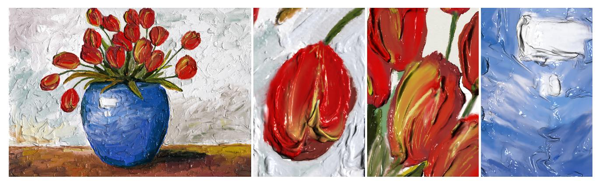

Figure 1: *A tulip vase example. Using our 3D painting system, artists can draw digital impasto style paintings like this one. The fine details resulted from bristle-level interactions cannot be easily produced by previous systems.* Copyright c Zhili Chen, Byungmoon Kim, Daichi Ito, and Huamin Wang 2015.

### **Abstract**

We present a real-time painting system that simulates the interactions among brush, paint, and canvas at the bristle level. The key challenge is how to model and simulate sub-pixel paint details, given the limited computational resource in each time step. To achieve this goal, we propose to define paint liquid in a hybrid fashion: the liquid close to the brush is modeled by particles, and the liquid away from the brush is modeled by a density field. Based on this representation, we develop a variety of techniques to ensure the performance and robustness of our simulator under large time steps, including brush and particle simulations in non-inertial frames, a fixed-point method for accelerating Jacobi iterations, and a new Eulerian-Lagrangian approach for simulating detailed liquid effects. The resulting system can realistically simulate not only the motions of brush bristles and paint liquid, but also the liquid transfer processes among different representations. We implement the whole system on GPU by CUDA. Our experiment shows that artists can use the system to draw realistic and vivid digital paintings, by applying the painting techniques that they are familiar with but not offered by many existing systems.

Keywords: fluid simulation, FLIP/PIC, Eulerian-Lagrangian, non-inertial frame, brush and hair, fluid coupling, GPU computing.

CR Categories: I.3.5 [Computer Graphics]: Computational Geometry and Object Modeling—Physically based modeling.

\*e-mail: {chenzhi,whmin}@cse.ohio-state.edu

† email: {bmkim, dito}@adobe.com **1 Introduction**

Painting with brushes has a long history that can be traced back to prehistoric days, when people used wood or bone sticks that later were evolved into bristles. Today, and in the future, painting with brushes is still, and will be, popular for hobby, kids' education, and professional arts and designs. For centuries, artists discovered, invented, and developed their art tools and materials to make the paintings detailed and impressive. In recent years, many artists expressed their interests in using computers to paint, because of its convenience and flexibility such as undo/redo, saving, uploading, and sharing. We believe that a high-quality computer-based painting system will be greatly appreciated by a large audience, including hobbyists, kids, and artists. In the future, if the fidelity of computer-based painting becomes so high that it is visually indistinguishable from real painting, we expect that the art of painting will be revolutionized for all humanity eventually.

Since artists are trained to become familiar with painting materials and techniques, which have proven to be effective for rich results through centuries, they expect that a computational system will provide the same experience as traditional painting in the real world. However, due to the limitation of the computer power and the complexity of the phenomena involved in real painting, computational painting remains as a difficult problem in computer graphics. The existing painting systems are one of the three types: procedural [\[Strassmann 1986;](#page-10-0) [DiVerdi et al. 2013\]](#page-9-0), example-based [\[Lu et al. 2013\]](#page-9-1), or simulation-based [\[Baxter et al. 2001;](#page-9-2) [Baxter](#page-9-3) et [al. 2004b;](#page-9-3) [Chu et al. 2010\]](#page-9-4). Procedural methods are fast and their results are clean, but they have limited complexity and they are unable to generate undefined effects. Example-based methods can produce highly detailed results, but they suffer from repetitiveness and discontinuity issues. They also have difficulty in mixing colors properly. In contrast, simulation-based methods can be highly realistic, depending on the physics models they are built upon. While researchers have extensively studied the simulation of paintcanvas interactions, little research effort was spent on modeling and simulating individual bristles and their interactions with 3D paint. As a result, existing systems either model a brush by a deformable model without individual bristles [\[Chu and Tai 2002;](#page-9-5) [Baxter et al.](#page-9-3) [2004b;](#page-9-3) [Chu et al. 2010\]](#page-9-4), or model a bristle brush but ignore the simulation of 3D paint completely [\[DiVerdi et al. 2010\]](#page-9-6).

Figure 2: *Details in real painting. This photograph demonstrates the rich painting details generated from bristle-paint interactions.*

A painting brush is made of bristles arranged in vastly different shapes, such as fan, flat, round, mop, rigger, angular, and filbert. During the painting process, each bristle strand interacts with other strands, paint, and canvas. Such interactions are complex, resulting in always unique bristle passage tails. For example, bristles can be pushed heavily against canvas to spread out a large area, as shown in Figure [3a](#page-1-0). Meanwhile, the bristle tips can be used to paint thin strokes, edit details, move a small amount of paint, or mix colors on canvas. The bristle shape change caused by a variety of factors, such as wetness, paint material, and external force, can lead to many interesting bristle behaviors. These behaviors are easily understandable by people at different skill levels, and widely used to achieve rich painting effects, such as Figure [2](#page-1-1) shows. To reproduce the painting process by computers, we cannot ignore the modeling and simulation of individual bristles.

In this paper, we study the development of the world's first realtime simulation-based 3D painting system with *bristle-level interactions*. The key challenge is *how we can achieve both e*ffi*ciency and realism in such detailed simulation, with limited computational power?* We especially favor the Eulerian-Lagrangian approach, which has demonstrated its capability of handling both large and small liquid features in a number of simulation techniques [\[Losasso](#page-9-7) [et al. 2008;](#page-9-7) [Lee et al. 2009;](#page-9-8) [Chentanez et al. 2014\]](#page-9-9). While researchers designed these previous techniques for the simulation of large water bodies and their thin features, we would like to consider the unique characteristics of painting simulation in this work.

- Paint motion is largely determined by brush motion. Artists use the brush to carry paint to different locations fast.
- Most paint liquids are highly viscous. They can hardly move, once the brush travels away from them.

Based on these two characteristics, we present our real-time painting system implemented completely on GPU. During the development of this system, we overcame the following challenges and made the corresponding technical contributions.

- Large time step. The limited computational resource requires us to use a large time step in simulation. When the forces are stiff, it can easily cause numerical instability under explicit time integration. To solve this issue, we formulate brush and fluid simulations in non-inertial local frames. This allows us to robustly handle the adhesion effect of paint liquid to brush bristles, when using a large time step.
- Inaccuracy. To prevent the liquid volume from being changed over time, fluid incompressibility can be enforced in many ways, most of which require an iterative solve. A real-time system cannot afford using many iterations or a sophisticated solver. Fortunately, we found that a fixed-point

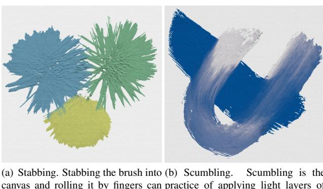

canvas and rolling it by fingers can create interesting textures. This technique usually works in conjunction with other brush strokes. (b) Scumbling. Scumbling is the practice of applying light layers of paint on top of drier, darker layers. It can be used to draw clouds or other mottled effects.

Figure 3: *Painting details generated by our GPU-based 3D painting simulation system at the bristle level.*

method can effectively improve the convergence of Jacobi iterations within a small number of iterations.

- Liquid transfer. Our system allows paint liquid to travel freely among different representations. To achieve this effect, we develop two liquid transfer processes in our system: bristle-particle liquid transfer and grid-particle liquid transfer. These two processes help the system conveniently use different liquid representations, to produce rich sub-pixel liquid details with a small computational cost.

Our experiment shows that the system can run at 30 to 110FPS on an Nvidia GeForce GTX TITAN X GPU. Artists can use the system to draw realistic and vivid digital paintings as Figure [1](#page-0-0) shows, by applying the painting techniques that they are familiar with, such as stabbing and scumbling shown in Figure [3.](#page-1-0) Many of these techniques and their effects cannot be easily produced by previous painting simulation systems.

## **2 Related Work**

**Physically based fluid simulation.** Existing fluid simulation methods can be categorized into Eulerian methods, Lagrangian methods, and hybrid methods that combine both. Here we are interested in the simulation techniques that can track the free surface of a liquid. In Eulerian methods, liquid is typically represented by 2.5D height fields [\[O'Brien and Hodgins 1995;](#page-10-1) [Wang et al.](#page-10-2) [2007\]](#page-10-2), or 3D volumetric grids [\[Osher and Sethian 1988;](#page-10-3) [Foster](#page-9-10) [and Fedkiw 2001\]](#page-9-10). Among Lagrangian methods, the most popular ones are formulated by solving smoothed particle hydrodynamics (SPH) [\[Gingold and Monaghan 1977;](#page-9-11) [Muller et al. 2003\]](#page-10-4) and its ¨ variations, such as PCISPH [\[Solenthaler and Pajarola 2009\]](#page-10-5) and WCSPH [\[Becker and Teschner 2007\]](#page-9-12). Based on SPH, Macklin and Muller [\[2013\]](#page-10-6) developed a position-based liquid simulator for bet- ¨ ter numerical stability. Recently, Zhu and colleagues [\[2014;](#page-10-7) [2015\]](#page-10-8) proposed a Lagrangian method to simulate both Newtonian and non-Newtonian liquids using simplicial complexes. Their system generated realistic and detailed painting effects, after spending a sufficiently large computational cost.

Researchers have also extensively studied hybrid methods that use both particles and grids, due to their flexibility in handling complex liquid behaviors. The early work done by Foster and Metaxas [\[1995\]](#page-9-13) solved the velocity field on a regular grid and tracked liquid cells by marker particles. Enright and collaborators [\[2002\]](#page-9-14) developed a particle level set method to address

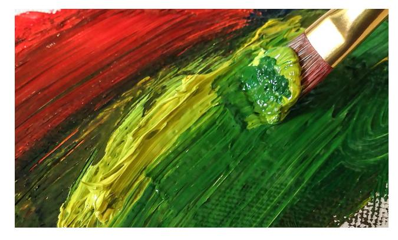

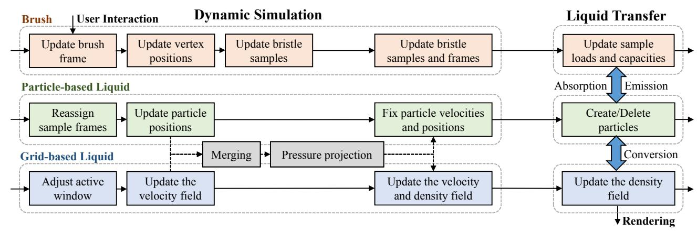

Figure 4: *System pipeline. Our system contains two major components. The dynamic simulation component simulates brush, paint, and their interactions. Meanwhile, the liquid transfer component allows paint liquid to travel freely among di*ff*erent representations.*

numerical dissipation in level set methods by marker particles near liquid surfaces. Particle-in-cells [\[Harlow 1964\]](#page-9-15) and fluidimplicit-particles [\[Brackbill and Ruppel 1986\]](#page-9-16) are two hybrid methods that use both grid cells and particles to store different liquid properties. Based on these two methods, researchers [\[Zhu](#page-10-9) [and Bridson 2005;](#page-10-9) [Boyd and Bridson 2012;](#page-9-17) [Hong et al. 2008;](#page-9-18) [Ando et al. 2012\]](#page-9-19) have explored a number of extensions, such as material point method [\[Sulsky et al. 1994;](#page-10-10) [Stomakhin et al. 2013\]](#page-10-11). Losasso and colleagues [\[2008\]](#page-9-7) and Lee and collaborators [\[2009\]](#page-9-8) formulated hybrid approaches that use both SPH and level set methods to simulate different liquid regions. Recently, Chentanez and colleagues [\[2014\]](#page-9-9) proposed to combine SPH, volume-of-fluid, and height field methods together for fast solve of large water effects. While our system also uses a hybrid representation to model different liquid regions, the challenge is how to customize it so that it is efficient and accurate for painting simulation.

**Hair-liquid coupling.** Our work is also related to recent research on hair-liquid coupling. Lin and colleagues [\[2011\]](#page-9-20) proposed to simulate the hydrophilic effect of hair by adhesion force. Later, they [\[2014\]](#page-9-21) developed a two-way coupling method to handle the interaction between hair and SPH liquid. Rungjiratananon and collaborators [\[2012\]](#page-10-12) presented a hybrid approach to model hair as dynamic anisotropic permeable material and simulated its wetting process. Recently, Akinci and colleagues [\[2013\]](#page-8-0) studied better surface tension and solid adhesion models under the SPH framework. During the painting process, a bristle does not deform as much as a hair does, but it can move rapidly due to brush motion. So we are interested in finding a unique solution to real-time simulation of bristle-liquid coupling, which has not been studied before.

**Simulation-based painting systems.** The early painting simulation system developed by Baxter and colleagues [\[2001;](#page-9-2) [2004b\]](#page-9-3) modeled a brush by a subdivision surface with mass-spring skeletons. It simulates paint as a 2.5D height field and stores pigment on the brush by a color map on brush surface. Chu and collaborators [\[2002\]](#page-9-5) improved this method by simulating skeleton motion under an energy minimization framework. To produce fine color and streak details in strokes, later they [\[2010\]](#page-9-4) investigated the use of the 2D imprint color map with a 3D brush. Baxter and collaborators [\[2004\]](#page-9-22) modeled each brush bristle as a polygon strip and stored colors on bristle vertices, but they did not model the physical interaction between bristles and paint on canvas. They [\[2004a\]](#page-9-23) have also explored the use of the volume-of-fluid method as a better liquid representation. Xu and colleagues [\[2002\]](#page-10-13) proposed to model a brush with many hair clusters, which can split during painting. Although they can simulate ink flow among clusters, they cannot handle two-way coupling between bristles and paint, nor individual bristle behaviors. DiVerdi and collaborators [\[2010\]](#page-9-6) simulated 3D brush bristles in a non-inertial brush frame, but handled paint and the actual painting process in 2D. Instead of simulating brushes, Okaichi and colleagues [\[2008\]](#page-10-14) also studied the simulation of painting knifes and their interactions with heightfield-based paint.

## **3 System Overview**

Our system contains two major components as Figure [4](#page-2-0) shows: dynamic simulation and liquid transfer. In each time step, the dynamic simulation component simulates brush, paint, and their interactions. Given the user input, the system first simulates the motion of each brush bristle and updates additional bristle samples. It then simulates each liquid particle around bristles twice, once in the nearby bristle sample frame and once in the canvas frame. The two results are blended together to update the position of the particle. Using this two-step approach, the system can robustly handle the adhesion effect of particles to bristles, even when the time step is large. Away from bristles, liquid is represented by a regular grid and simulated in an active window only. To achieve incompressibility in both particle-based liquid and grid-based liquid, the system merges the two into joint density and velocity fields. It then makes the joint velocity field divergence-free by pressure projection, and updates both particles and the density field. After dynamic simulation ends, the liquid transfer component handles the liquid exchange among bristles, particles, and the density field. Depending on the distance to bristles, liquid can be represented as a mass value stored within a bristle sample, a liquid particle, or a density value within a grid cell. Our system allows particles to be dynamically created or removed, depending on brush movement.

The pigments within liquid determine the appearance of a painting. Here we define the pigment color by a red-yellow-blue vector, stored in every liquid representation. In addition, we use two scalar variables to control liquid motion behavior. The dryness determines when paint liquid becomes dry and behaves as solid. The oil density controls liquid viscosity and liquid transparency in rendering. We will discuss their use later in Sections [4](#page-2-1) and [6.](#page-7-0)

# **4 Dynamic Simulation**

In this section, we will discuss how the system simulates brush bristles, particle-based liquid, and grid-based liquid. We note that these three parts are not handled independently. Particle-based fluid

and grid-based fluid are coupled together through a joint pressure projection step. The joint velocity field also helps us achieve twoway coupling between bristles and paint liquid.

#### **4.1 Brush Modeling and Simulation**

A brush model is made of many bristles, each of which contains a list of vertices as Figure [5](#page-3-0) shows. User directly controls brush motion, which can be arbitrarily large within one time step. Even in such a case, brush bristles should follow the brush tightly. This can be achieved by applying large spring forces, but explicit time integration is numerically unstable and implicit time integration is too expensive for real-time applications. Intuitively, simply repositioning bristle vertices near the brush may work, with some way to control that amount. Based on this idea, we first investigate Newtonian dynamics in the non-inertial brush frame, and then design a unique simulation treatment accordingly.

Let canvas do not move, so it defines an inertial frame where Newtonian physics always holds. Let x*i* and v*i* be the position and velocity of a bristle vertex *i* in the canvas frame. We first convert them into the brush frame as:

$$\mathbf{x}_i^B = \mathbf{R}_B(\mathbf{x}_i + \mathbf{c}_B), \quad \mathbf{v}_i^B = \dot{\mathbf{x}}_i^B, \quad (1)$$

in which RB and cB are the rotation matrix and the translation vector describing the rigid transformation from the canvas frame to the brush frame. Let v and ωB be the linear and angular velocities of the brush frame, observed in the canvas frame but defined in the brush frame. Using the calculus of vector derivatives in moving frames, we can rewrite Newton's laws in the brush frame and derive the total inertial acceleration applied on *i* in the brush frame as:

$$\mathbf{v}_i^B = \mathbf{R}_B \mathbf{a}_i - \boldsymbol{\beta}_B \left( \mathbf{v}^B + \boldsymbol{\omega}^B \times (\boldsymbol{\omega}^B \times \mathbf{x}_i^B) + \boldsymbol{\omega}^B \times \mathbf{x}_i^B + 2\boldsymbol{\omega}^B \times \mathbf{v}_i^B \right), \quad (2)$$

in which a*i* is the external acceleration applied on *i* in the canvas frame, including the gravity force and the drag force due to the grid-based liquid flow handled later in Subsection [4.2.](#page-3-1)

The second term in Equation [2](#page-3-2) contains four inertial accelerations written in terms of non-inertial frame coordinates. These are rectilinear acceleration, centrifugal acceleration, Euler acceleration, and Coriolis acceleration, respectively. Intuitively, these accelerations try to drag the vertex away from the brush, when it suddenly accelerates or decelerates. So we introduce a coefficient βB to control their influence. When βB = 1, Equation [2](#page-3-2) is equivalent to Newtonian physics, and when βB = 0, Equation [2](#page-3-2) forces the vertex to stay with the brush in a position-based way. Using a small βB, we can integrate Equation [2](#page-3-2) explicitly to update x *i* and v B *i* . We typically set βB ∈ [0, 0.1] to make bristles follow brush motion fast for better user control. If the brush is small and stiff, we can even set βB = 0 to draw thin and clear lines. After explicit time integration of the forces, we enforce inextensible and bending constraints on vertex positions and velocities by the position-based method [\[Muller et al. 2007\]](#page-10-15). Finally, we convert the vertex back ¨ from the brush frame into the canvas frame.

So far, we assume that the bristles are infinitely thin and we can simulate them independently. In reality, however, the bristles cannot be clustered into an infinitely small volume due to their thickness. To correctly produce the clustering effect, one method is to report a collision when two bristle segments intersect and remove the collision by repulsion impulses. Unfortunately, collision detection and handling is computationally expensive even on GPU. So our solution is to estimate the bristle vertex density at each vertex using a smoothed kernel function, and then enforce a minimal density constraint on it at the end of the brush simulation step. Implementation details about such position-based density constraints can be found in [\[Macklin and Muller 2013\]](#page-10-6). ¨

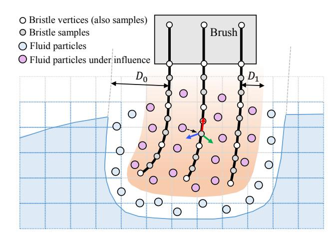

Figure 5: *Brush and liquid models. Our system uses samples to represent each bristle, and uses particles to represent the liquid within D*0 *distance away from bristles. If the distance from a particle to its closest sample is less than D*1*, it is under the influence of that sample and it will be simulated in the local sample frame once for the adhesion e*ff*ect.*

**Bristle samples and local frames.** Each bristle contains enough vertices to ensure its smoothness during simulation. But these vertices are usually not dense enough to model the interaction between bristles and paint liquid. To solve this issue, we propose to create more samples over each bristle, as shown in Figure [5.](#page-3-0)

Let each bristle be represented by a cubic Hermite spline curve, whose points are specified by the vertices and whose tangents are calculated by finite difference. We select samples from the curve densely, so that the gap between two samples is smaller than the size of a pixel. To determine the local frame of each sample *j* spanned by three unit axial vectors t*j* , n*j* , b*j* , we use the minimal twist method [\[Bishop 1975;](#page-9-24) [Bergou et al. 2008\]](#page-9-25). Once we update all of the sample positions and their local frames, we rasterize them into a density field and a velocity field. They will be used as boundary conditions in grid-based liquid simulation next.

## **4.2 Grid-based Liquid Simulation**

Let us first consider grid-based simulation of paint liquid using an Eulerian approach. We discretize the space above canvas into a regular 3D grid at the pixel level and define scalar variables, including liquid density, pigment color, oil density and dryness, in each grid cell. The velocity field is defined at each cell face in a staggered fashion. We model paint liquid by a 3D density field, rather than other fields1 (such as the level sets), because it is inexpensive to maintain and it can conveniently handle the liquid transfer to and from particles, which will be discussed later in Subsection [5.2.](#page-6-0)

We develop our Eulerian liquid simulator in a standard way and we advect all of the fields using the semi-Lagrangian method [\[Stam](#page-10-16) [1999\]](#page-10-16). The discretized bristle density and velocity fields in Subsection [4.1](#page-3-3) are treated as boundary conditions in pressure projection. In each time step, we also increase the dryness of every grid cell by a small amount. Once the dryness of a cell reaches a threshold, we ignore its velocity and we treat it as a solid cell in pressure

1A more economic representation is to define a 3D density field on top of a height field. However, our experiment shows that this representation has difficulty in maintaining overhanging liquid features even under high viscosity, due to limited accuracy in the canvas normal direction.

#### Algorithm 1 Fixed Point Pressure Projection(u, *P*)

for *l* = 1, ..., *L* do

 $P = \alpha P;$ 

 $D = \nabla \cdot \mathbf{u};$ 

*P* = One Jacobi Iteration(*P*, *D*);

*P* = One Jacobi Iteration(*P*, *D*);

 $\mathbf{u} \leftarrow \mathbf{u} - \nabla P;$ 

return u;

projection as well.

One of the key challenges here is how can we quickly solve the linear system involved in pressure projection, which is known to be the bottleneck in many existing simulators. Since the liquid domain changes over time, we have to use iterative solvers, instead of direct solvers. Our limited computational power also prevents us from using sophisticated iterative solvers, such as conjugate gradient. In fact, we can afford only a few Jacobi iterations and the calculated pressure result often has a large residual error, as Figure [6](#page-4-0) shows. To make the Jacobi solver converge faster, we found that a fixedpoint method shown in Algorithm [1](#page-4-1) can be very effective. Let Ax = (D − R)x = b be the linear system of pressure projection, in which D is the diagonal component of A. The fixed-point method is mathematically equivalent to:

$$\begin{cases} \mathbf{b}^{(k+1)} = \mathbf{b}^{(k)} - \mathbf{A}\mathbf{y}^{(k)}, \\ \mathbf{y}^{(k+1)} = \mathbf{D}^{-1} \left( \mathbf{b}^{(k+1)} + \mathbf{R}\mathbf{D}^{-1} \left( \mathbf{b}^{(k+1)} + \alpha \mathbf{R}\mathbf{y}^{(k)} \right) \right), \end{cases} \quad (3)$$

whose actual solution is given by: x (*k*+1) = P*k*+1 *n*=0 y (*n*) . Let O = D −1R. We can derive the recurrence form of x (*k*+1) as:

$$\mathbf{x}^{(k+1)} = (\mathbf{I} - \mathbf{O}^2)\mathbf{x} + \mathbf{O}^2\mathbf{x}^{(k)} + \alpha\mathbf{O}^2 \left( \mathbf{x}^{(k)} - \mathbf{x}^{(k-1)} \right), \quad (4)$$

whose error  $\mathbf{e}^{(k+1)} = \mathbf{x}^{(k+1)} - \mathbf{x}$  is:

$$\mathbf{e}^{(k+1)} = \mathbf{O}^2 \mathbf{e}^{(k)} + \alpha \mathbf{O}^2 \left( \mathbf{e}^{(k)} - \mathbf{e}^{(k-1)} \right). \quad (5)$$

Equation [5](#page-4-2) is relevant to the Chebyshev semi-iterative method [\[Gol](#page-9-26)[ub and Van Loan 1996\]](#page-9-26), which also uses x (*k*−1) and has the following recurrence form:

$$\mathbf{e}^{(k+1)} = \omega_{k+1} \mathbf{O}\mathbf{e}^{(k)} + (1 - \omega_{k+1}) \mathbf{e}^{(k-1)}, \quad (6)$$

where ω*k*+1 is calculated using an estimation ¯ρ of the spectral radius ρ(O). The Chebyshev method is similar to the weighted Jacobi method, whose error can be formulated as:

$$\mathbf{e}^{(k+1)} = \omega \mathbf{O}\mathbf{e}^{(k)} + (1 - \omega)\mathbf{e}^{(k)}, \quad (7)$$

in which ω is now a weight constant. Figure [6](#page-4-0) compares the convergence rates of the three methods. At first glance, it seems that our method is not very attractive, as it converges slower than the Chebyshev method when both use optimal parameter values2 . Interestingly, if we look closely at the first few iterations as shown in Figure [6d](#page-4-0), we can see that our method actually has the fastest convergence rate when α = 1. This is because its matrix has complex eigenvalues and its result oscillates, causing the error to decrease much faster at the beginning. We note this is a typical phenomenon, and it is relatively independent of the grid resolution and the system stiffness. In our experiment, we use three fixedpoint iterations, or six Jacobi iterations. The parameter α is simply set to 1, so no parameter tuning is needed.

2The optimal α of our method can be estimated using the spectral radius of O2 . Please see the supplemental document for explanation.

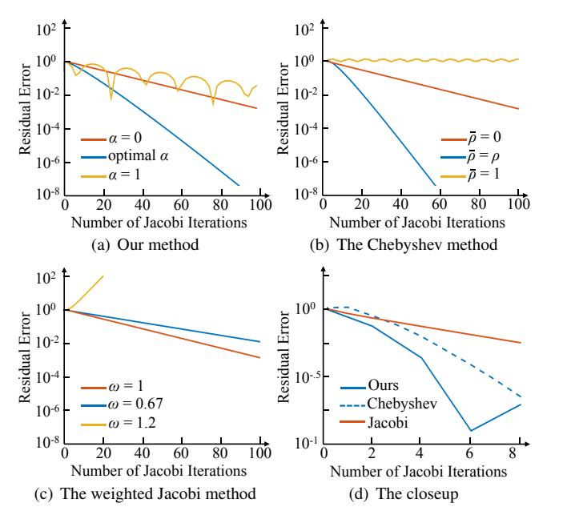

Figure 6: *The convergence rates of di*ff*erent methods. Our method, the Chebyshev method, and the weighted Jacobi method are all equivalent to the Jacobi iterative method, when* α = 0*,* ρ = 0*, and* ω = 1*, respectively. Although our method does not converge as fast as the Chebyshev method does, it has the fastest convergence rate within the first six Jacobi iterations when* α = 1*. Note that each fixed-point iteration of our method uses two Jacobi iterations.*

Even with our fast pressure projection solver, we still cannot afford running grid-based simulation over the whole grid. Fortunately, since liquid motion is often triggered by brush activities and liquid velocity can be quickly eliminated by high viscosity, we can restrict grid-based simulation to a small active window around the brush. We typically set the window size to: 128 × 128 × 32. We update the window location at the beginning of each time step. An even better strategy is to use multiple windows and center them at high flow regions. However, this method is more complex and we do not consider it at this time.

## **4.3 Particle-based Liquid Simulation**

At the pixel level, grid-based liquid is memory and computationally inexpensive to handle. But at the sub-pixel level, which is needed to model details generated by thin bristles, grid-base liquid becomes too expensive. Grid-based liquids also suffer from numerical dissipation, which can be noticed as overly blurry or smoothed artifacts, as Figure [7a](#page-5-0) shows. Last but not least, the pressure projection step in grid-based simulation can be inaccurate, when user moves the brush rapidly within paint liquid. This numerical inaccuracy can cause obvious volume change artifacts, as shown in Figure [7c](#page-5-0). To solve these issues, we propose to simulate liquid around the brush by particles. Figure [7b](#page-5-0) and [7d](#page-5-0) demonstrate that this approach can preserve subtle color details and liquid volume well.

**Position-based liquids.** We started building our system by using the position-based fluid method proposed by Macklin and Muller [\[2013\]](#page-10-6). The basic idea of this method is to iteratively ¨ enforce the density constraint at each particle. We liked this method, since we can handle the interactions among liquid particles and bristle vertices under the same position-based framework by optimizing all of their constraints together. Unfortunately, we found

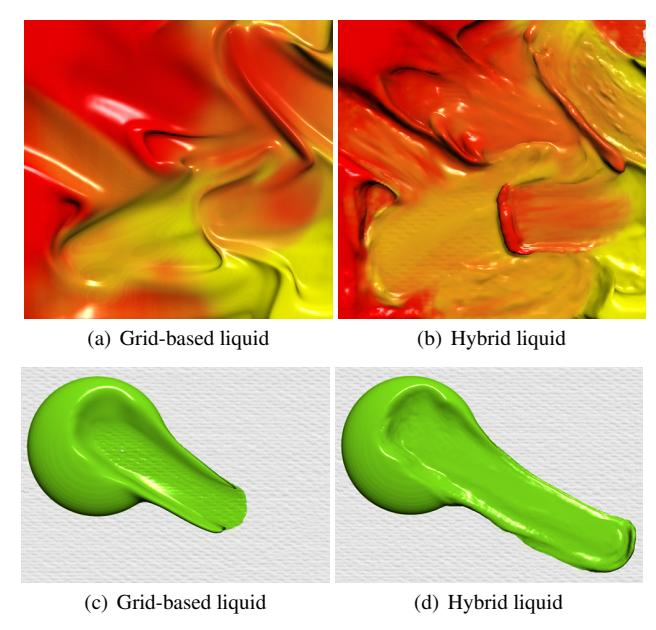

Figure 7: *The results of di*ff*erent liquid representations. Using the hybrid liquid representation, our system can produce more detailed and volume-preserving results shown in (b) and (d).*

several issues that prevent us from using it in practice. First, the method tends to produce bumpy surfaces, if the system does not use a sufficient number of iterations to reduce the density error. Second, our system needs 200K to 1M particles to model sub-pixel liquid details, which is way too many for the position-based method to handle in real time. Finally, the method is sensitive to particle distribution and it can cause sudden surface changes, when particles are removed or added by liquid transfer processes.

**FLIP/PIC liquids.** So we choose to simulate liquid particles in a fluid-implicit-particles/particle-in-cells (FLIP/PIC) fashion. In each time step, we renew particle velocities by external forces and update particle positions. To model the slippery condition and the high viscosity effect, we apply a friction force at each particle *k*:

$$\mathbf{f}_k^{\text{friction}} = -\max\left((1 - \delta d_k)^2, 0\right) \mathbf{v}_k, \quad (8)$$

in which v*k* is the particle velocity, *dk* is the distance from the particle to the solid surface, and δ is a constant controlling the force range. To model the adhesion effect of the particle to bristles, we can also define an adhesion force. However, this adhesion force must be highly stiff to prevent the particle from leaving bristles, which causes numerical instability when the force is integrated explicitly. To solve this problem, we propose to simulate the particle twice, once in the local bristle sample frame and once in the canvas frame. Specifically, we assign particle *k* to its closest bristle sample and convert its position and velocity into the noninertial local frame of that sample: p L and v L . We calculate the total acceleration of the particle in the local frame by:

$$\mathbf{v}_k = \mathbf{R}_{\mathbf{r}} \mathbf{a}_k - \boldsymbol{\beta}_L \left( \mathbf{v}^+ + \boldsymbol{\omega}^+ \times (\boldsymbol{\omega}^- \times \mathbf{p}_k^-) + \boldsymbol{\omega}^- \times \mathbf{p}_k^+ + 2\boldsymbol{\omega}^- \times \mathbf{v}_k^+ \right), \quad (9)$$

in which a*k* is the external acceleration including the gravity and the friction, RL is the rotation matrix from the canvas frame to the local frame, v L and ωL are the linear and angular velocities of the local frame observed in the canvas frame but defined in the local frame, and βL is a coefficient controlling the magnitude of inertial acceleration effects. When βL < 1, Equation [9](#page-5-1) achieves the

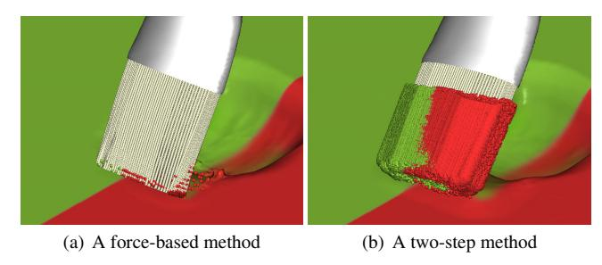

Figure 8: *A comparison example. Our two-step method can keep liquid particles following bristles as shown in (b), while the forcebased method using explicit time integration fails as shown in (a). Both methods use the same time step. We maximize the force sti*ff*ness in the force-based method without numerical instability.*

adhesion effect, by reducing the inertial accelerations that drag the particle away from bristles. After we update the particle position using the total acceleration in the local frame, we convert it back into the canvas frame as p 0 *k* . Meanwhile, we still update the particle position in the canvas frame using explicit time integration to get p 00 , without considering adhesion. The position of particle *i* (in the canvas frame) is finally updated by:

$$\mathbf{p}_k^{\text{new}} = \mathbf{p}_k' + \max(1 - d_{B,k}/D_1, 0) (\mathbf{p}_k' - \mathbf{p}_k'), \quad (10)$$

where *d*B,*k* is the particle distance to bristles and *D*1 is a variable specifying the range of the adhesion effect. After the particle position is updated, we correct the particle velocity in the canvas frame.

Intuitively, the particle position in the local frame is calculated in a position-based way, so the particle can follow bristles closely and stably if it is close to bristles. On the other hand, if the particle is away from bristles, its motion is less affected by bristles and it can escape from their influence eventually. Figure [8](#page-5-2) compares our two-step method with the force-based method using explicit time integration. While the force-based method fails to keep particles close to bristles, our two-step method can achieve the adhesion effect without numerical instability.

After we update particle positions, we rasterize them into density and velocity fields, and combine them with the existing fields representing the grid-based liquid. Rather than performing viscosity and pressure projection steps on the original velocity field, we perform them on the joint velocity field u. Given the updated divergencefree velocity field u¯, we correct the particle velocity v*k* by a mixed FLIP/PIC model:

$$\mathbf{v}_k^{\text{new}} = \gamma \bar{\mathbf{u}}(\mathbf{p}_k) + (1 - \gamma)(\mathbf{v}_k + \bar{\mathbf{u}}(\mathbf{p}_k) - \mathbf{u}(\mathbf{p}_k)), \quad (11)$$

in which the parameter γ is typically set to 0.8. Different from conventional FLIP/PIC methods that allow only particles to carry mass and velocities, our method keeps the updated velocity field to the next time step. This velocity field not only provides the drag force used for brush simulation in Equation [4.1,](#page-3-3) but also helps us more accurately track the boundary between particle-based liquid and grid-based liquid without additional velocity extrapolation.

# **5 Liquid Transfer**

Here we will describe the liquid transfer processes among bristle samples, liquid particles, and the density field. Since brush bristles are not in direct contact with grid-based liquid, we consider only two liquid transfer processes: bristle-particle liquid transfer and grid-particle liquid transfer.

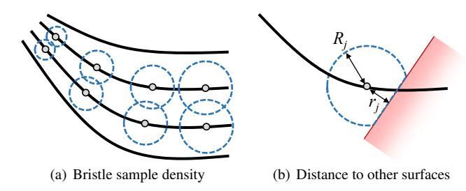

Figure 9: *Factors a*ff*ecting the sample capacity. Using the sample density and the sample distance to other surfaces, we define the maximum liquid amount that can be stored within a bristle sample.*

### **5.1 Bristle-Particle Liquid Transfer**

A brush bristle can keep paint liquid due to its hydrophilicity, even after being wiped on canvas many times in the real world. Given the two-step method described in Subsection [4.3,](#page-4-3) our system can simulate this effect using sufficiently small particles and time steps. Unfortunately, we cannot afford doing so in real-time simulation, and all of the particles will leave bristles inevitably as a result.

To solve this issue, we propose to let a small amount of paint liquid be loaded at each bristle sample, representing the liquid that cannot easily leave the bristle. Let *j* be a bristle sample located at x*j* . We define its current liquid load as *mj* , its total saturation capacity as *Mj* , and its pigment as c*j* , a 3D vector describing its color. When *mj* changes over time, the capacity *Mj* also changes over time due to two factors. First, the capacity depends on the gap among bristles: a sample should store more liquid, if it is away from other samples; and it should store less liquid, if it becomes closer to other samples under compression, as Figure [9a](#page-6-1) shows. We calculate the potential capacity *M*0 of sample *j* using the bristle sample density field ψ, given in Subsection [4.1:](#page-3-3)

$$M_j' = \max \left( (1 - \mu \cdot \psi(\mathbf{x}_j))M_{\max}, M_{\min} \right), \quad (12)$$

in which µ is a control parameter, and *M*max and *M*min are the maximum and minimum capacity values. Second, the capacity should be reduced, when the sample becomes closer to the surface of the grid-based liquid, or a solid boundary surface, e.g., when we wipe the bristle over canvas. Let *rj* be the distance from the sample to such a surface, clamped between 0 and *Rj* , as Figure [9b](#page-6-1) shows,

where *Rj* = 3 r 3*M*0 4πρ0 and ρ0 = 1.0 × 103kg/m3 is the reference paint density. Assuming that paint liquid is distributed evenly around the sample in a spherical shape, we calculate the actual sample capacity *Mj* by:

$$M_j = M'_j - \rho_0 \pi(R_j - r_j)^2 \left( R_j - (R_j - r_j)/3 \right). \quad (13)$$

Intuitively, *Mj* is the total liquid volume that can be stored within the spherical cap, after the sphere is chopped off by a plane. Note that if the sample is away from any surface, *rj* = *Rj* and *Mj* = *M*0 .

**Absorption.** Once we obtain the capacity *Mj* of a bristle sample *j*, it is straightforward to model the liquid transfer to and from the sample, based on its current load *mj* . To test whether sample *j* should absorb more particles, we check whether *mj* < *Mj* and any liquid particle *k* exists within the radius *Rj* from the sample, as Figure [10](#page-6-2) shows. If so, we add the particle mass *mk* to *mj* and mix the particle pigment vector c*k* with the sample pigment vector c*j* :

$$m_j^{\text{new}} = m_k + m_j, \quad m_j^{\text{new}} = \text{Color\_Mix}(\mathbf{c}_k, \mathbf{c}_j, m_k, m_j), \quad (14)$$

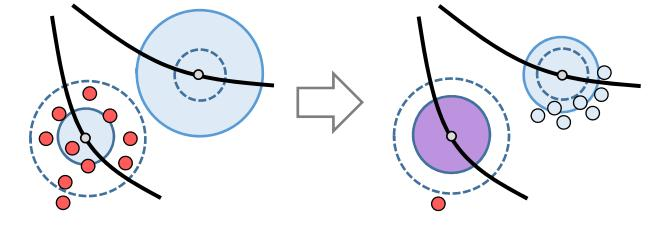

Figure 10: *Particle absorption and emission. The capacity (in dotted lines) of one particle is above its liquid load (in solid lines), so it absorbs particles (in red). In contrast, the capacity of the other particle is below its liquid load, so it emits particles.*

in which Color Mix is the mixing function defined in Section [6.](#page-7-0) After we add the particle content into the bristle sample, we remove the particle. Although the sample cannot absorb more particles once *mj* ≥ *Mj* , we still allow the color mixing process to happen between particle *k* and sample *j*. This is to model the color bleeding effect, in which a saturated bristle can still pick up new colors through its contact with paint liquid.

**Emission.** If *mj* > (1+)*Mj* , we ask the sample to release its load by emitting new particles in its neighborhood. We calculate each new particle position using a pre-defined pattern, which uniformly distributes particles in the bottom hemisphere of the sample, as Figure [10](#page-6-2) shows. The new particles share the same attributes as the sample, including the velocity. Here is a small positive constant to prevent particles from being repetitively emitted and absorbed. So the load of the sample can be stabilized at *mj* ∈ [*Mj* , (1 + )*Mj*]. To further smoothen the liquid transfer process, we also set a limit on the maximum number of particles that can be absorbed or emitted by a sample per time step.

### **5.2 Grid-Particle Liquid Transfer**

Our system allows the conversion between particle-based representation and grid-based representation. For simplicity, we assume that liquid within distance *D*0 from bristles must be represented by particles, as Figure [5](#page-3-0) shows. So if a grid cell is found to be within this distance range and its density is positive, we use stratified sampling to select 27 particle candidates within the grid cell. We then check the interpolated liquid density at each candidate and convert a candidate into a liquid particle, if its density is positive. Once we generate the new particles, we reduce the density of a grid cell *c* by:

$$\rho_c^{\text{new}} = \max \left( \rho_c - m_k \sum_{k=1}^K W(\mathbf{p}_k - \mathbf{x}_c, h), 0 \right), \quad (15)$$

in which {p1, p2, ..., p*K*} are the new particles near the grid cell location x*c* , *mk* is the particle mass, and *W* is a smoothing kernel function with length *h*. Note that *c* can be any cell near new particles and it does not have to emit any particle. The reason we do not limit the density change to particle-emitting cells is to ensure sufficient smoothness in the density field.

Similarly, we transfer the liquid represented by a particle back into the density field, if the particle moves slowly and its distance to the bristles is above *D*0. To do that, we increase the cell density by:

$$\rho_c^{\text{new}} = \rho_c + m_k \sum_{k=1}^K W(\mathbf{p}_k - \mathbf{x}_c, h), \quad (16)$$

in which {p1, p2, ..., p*K*} are now the removed particles. Other liquid particle variables, such as oil density and dryness, can be simply

| Symbol                    | Usage                                             |
|---------------------------|---------------------------------------------------|
| $i$                       | A bristle vertex                                  |
| $j$                       | A bristle sample                                  |
| $r_j$                     | Sample distance to solid/grid-fluid surface       |
| $k$                       | A fluid particle                                  |
| $d_k$                     | Particle distance to solid surface                |
| $d_{B,k}$                 | Particle distance to bristles                     |
| $\alpha = 1$              | Pressure projection solver (in Eq. 3)             |
| $\beta_B \in [0, 0.1]$    | Simulating bristles in the brush frame (in Eq. 2) |
| $\beta_L \in [0, 0.2]$    | Simulating particles in local frames (in Eq. 9)   |
| $\delta = 1/0.2\text{cm}$ | Particle friction range (in Eq. 8)                |
| $\gamma = 0.8$            | Blending particle positions (in Eq. 11)           |
| $\mu = 0.5$               | Estimating bristle sample capacity (in Eq. 12)    |
| $\epsilon = 0.1$          | Sample emission epsilon                           |
| $D_0 = 1\text{cm}$        | Distance range for grid-particle conversion       |
| $D_1 = 0.3\text{cm}$      | Distance range for bristle-particle adhesion      |

Table 1: *Variables and parameters. This table lists important variables and parameters, and their value ranges used in this paper.*

| Algorithm 2 Color_Mix( $\mathbf{c}_i, \mathbf{c}_j, \mathbf{w}_i, \mathbf{w}_j$ ) |
|-----------------------------------------------------------------------------------|
| $b_i \leftarrow \ \text{RYBtoRGB}(\mathbf{c}_i)\ _{\mathbf{M}};$                  |
| $b_j \leftarrow \ \text{RYBtoRGB}(\mathbf{c}_j)\ _{\mathbf{M}};$                  |
| $\mathbf{c}' \leftarrow (w_i \mathbf{c}_i + w_j \mathbf{c}_j) / (w_i + w_j);$     |
| $b' \leftarrow \ \text{RYBtoRGB}(\mathbf{c}')\ _{\mathbf{M}};$                    |
| $b'' \leftarrow (w_i b_i + w_j b_j) / (w_i + w_j);$                               |
| <b>return</b> $b'' \mathbf{c}' / b';$                                             |

merged into the grid cells using linear interpolation. The exception is the pigment color, whose interpolated intensity is adjusted to maintain a proper brightness level. Please see Section [6](#page-7-0) for details.

# **6 Implementation**

We implemented the whole system on GPU by CUDA. In our system, particle rasterization requires using many atomic operations, which are found to be computationally expensive. Another computational bottleneck is the neighborhood search, which is done using the sorted hash list [\[Green 2010\]](#page-9-27). Table [1](#page-7-1) summarizes some of the variables, the parameters, and their values ranges. Below are additional implementation details.

**Color mixing model.** Our system defines a pigment vector by three channels: red, yellow, and blue. This RYB model allows additive color mixing to be performed more naturally and intuitively, as Gossett and Chen [\[2004\]](#page-9-28) showed. To mix two colors, we use a brightness-preserving color mixing function shown in Algorithm [2.](#page-7-2) Here kxkM measures the brightness of x in the RGB space: kxkM = (x TMx) 1 2 , in which M = diag(0.241, 0.691, 0.068) is a diagonal matrix. Intuitively, Algorithm [2](#page-7-2) adjusts the intensity of the interpolated color vector, so that its brightness is equivalent to the interpolated brightness of the two input color vectors. The mixing of multiple colors can be handled in a similar way, by doing linear interpolation first and then adjusting the brightness intensity. We found that our color mixing model3 can provide more vivid results. For example, it blends blue pigment and yellow pigment into green pigment, as Figure [11c](#page-7-3) shows.

**Liquid rendering.** We use the ray casting technique to render the fluid volume on the OpenGL platform. Specifically, in each fragment shader, we shoot a ray from the camera to every pixel sample in the image plane. Along the ray, we sample the density

3We note that this model is not physically correct, as the brightness does change after fluid mixing in the real world.

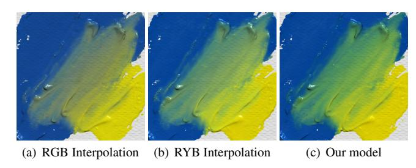

Figure 11: *The results of color mixing models. Compared with linear interpolation in the RGB space in (a) and linear interpolation in the RYB space in (b), our brightness-preserving color mixing model can provide a more vivid and plausible result shown in (c).*

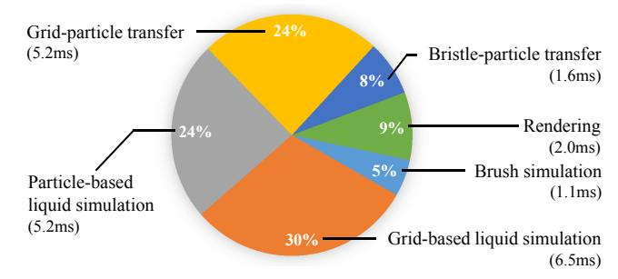

Figure 12: *The Breakdown of the computational cost. Liquid simulation and grid-particle liquid transfer are the most expensive steps. This example uses 210K particles and runs at 46FPS.*

value every one quarter of the density grid size. We detect a surface intersection once the density is found to be greater than a certain threshold. At the intersection point, we calculate the surface normal from the density gradient, and sample the pigment color and the oil density. To produce transparency effects, we use the oil density to calculate a penetration distance and we allow more pigment samples to be collected along the ray into the surface within that distance. We blend all of the pigment samples together to determine the final color of the ray. We use ambient occlusion to produce shadow effects, by shooting 64 rays around the intersection point and collecting the maximum density values these rays can reach within a short distance. To reduce the rendering cost, we redraw the active simulation window only when there are activities in it. To render liquid particles, we use the screen-space method proposed in [\[van der Laan et al. 2009\]](#page-10-17). The discrepancy between the volume rendering mode and the particle rendering mode can cause temporal discontinuity around the brush, i.e., liquid particles disappearing when it is transferred into grid cells. Fortunately, this problem is noticeable only in closeup views.

# **7 Results and Discussions**

We tested the performance of our system on an Intel i7-5930K 3.5GHz desktop with an NVIDIA GeForce GTX TITAN X GPU. Figure [12](#page-7-4) shows a typical breakdown of our computational cost. Our system performance varies from 30 to 110 FPS, depending on the size of the brush and the total number of active particles. We typically set the grid resolution to 4096 × 4096 × 64. Currently, the brushes in our system contain 40 to 600 bristles, and each bristle contains 10 vertices and 128 samples. For a large brush, the system can generate as many as 2M particles in simulation. User can tune a number of parameters to trade between the performance and the result quality. For example, *D*0 can be reduced to use fewer particles, so that the system can run faster with lower-quality

Figure 13: *Our early result simulated by GLSL shaders. While the result looks plausible, the system su*ff*ers from two main limitations.*

results. Similar to real painting, our system allows users to control the painting style by adjusting the oil density level: higher oil density helps create paintings in a thin and flat style as shown in Figure [15,](#page-10-18) while lower oil density helps create thick paintings as shown in Figure [1.](#page-0-0) (Please see the supplemental video for simulation examples.)

**Comparison to a shader-based system.** Before developing our current system, we built and tested several other simulationbased painting systems, including the one using GPU shaders. We liked the shader-based system, since it is cross-platform. Specifically, we implemented a level-set-based fluid simulator on a farfield grid proposed in [\[Zhu et al. 2013\]](#page-10-19) using GLSL shaders, and we simulated brush dynamics on CPU. We carefully minimized the data transfer between CPU and GPU, and balanced their workloads to avoid one from being held by the other. While this system generates acceptable brush stroke effects as shown in Figure [13,](#page-8-1) it suffers from two main limitations that prevent us from exploring it even further. First, it is computationally expensive to simulate and render thick paint by GLSL shaders, since paint volume stored in a 3D texture must be loaded into a 2D framebuffer one layer at a time for shaders to work on. Second, it is difficult to address volume loss and surface quality issues, without increasing the computational cost. Our system avoids these problems, by using the flexible CUDA platform and a hybrid simulation strategy that combines particles with the density grid.

**Feedback from artists.** We invited artists to evaluate the usability of our system. The artists were impressed by our system and they informed us that this was the first time for them to feel like doing real painting. Figure [14](#page-9-29) compares the result of our system with the results of previous virtual painting systems. Below is a summary of their comments regarding our system and previous systems.

- Our system generates many realistic and unexpected variations. In contrast, other systems cannot generate the same amount of details.
- Our system produces different painting patterns. Some systems use stamp maps and their results have noticeable repeated patterns. Some systems also create the same pattern regardless of the stroke speed.
- Using our system, artists can control the brush edge by pressing strongly or softly and adjusting the stroke speed. This is not doable by many previous systems.

- Our system allows color mixing through pick-up in the brush. In the past, the simulation of color mixing was either unnatural, or limited.

The performance of the current system is one of its main drawbacks, as artists pointed out. Specifically, it places a limit on the stroke speed, so artists need more time to finish paintings in our system than in the real world. Interestingly, this limit also affects their workflow. In the real world, artists usually draw rough sketches first, and then gradually add details. Since they cannot do sketching fast in our system, they prefer to skip it as our video shows. Allowing fast strokes will greatly improve the usability of our system.

**Other limitations.** Real paint is a shear thinning fluid, whose viscosity decreases under shear strain. For simplicity, our physics model does not consider this effect. Currently, our system relies on particles to deposit paint liquid and mix color through the pigment blending process. This requires particles to be densely sampled. if we reduce the particle density for fast performance, dirty color mixing or noisy surface artifacts may appear. Although the use of FLIP/PIC helps preserve volume, we still cannot strictly achieve incompressibility in this system. Particles may also become nonuniformly distributed over time. As a result, when user moves the brush in a jittering way, the paint surface can become bumpy due to clustered particles. We cannot afford using smaller time steps or a densely sampled stroke path to address this issue. The computational cost of our current system requires it to use highperformance graphics hardware. We have tested our system on some low-end hardware, but the result is not satisfactory yet. Finally, this work is focused on shape fidelity, not color fidelity. Our current color mixing model is still too simple and we would like to improve its accuracy in the future.

## **8 Conclusions and Future Work**

In this paper, we have presented a real-time painting simulation system that models the interactions among brush, paint, and canvas at the bristle level. This system is made possible, thanks to a variety of techniques we developed on today's high-performance GPU. Our experiment shows that bristle-level interactions are important to the realism of computer-based painting.

In the future, we would like to improve the accuracy of our brush simulator, e.g., bristle softness after being wetted and surface tension. We also would like to incorporate water color and wet canvas effects into the system, so that paint can travel within canvas through percolation. An interesting question is how can we achieve high-quality simulation results on low-end devices. To answer this question, we are interesting in exploring alternative models and tools that can produce quality results fast. Finally, we will develop more accurate color mixing models and detail enhancement approaches, to further improve our result quality.

# **9 Acknowledgments**

We would like to thank NVIDIA for funding and equipment support. This work was supported in part by the open project program of the State Key Lab of CAD&CG at Zhejiang University.

# **References**

Akinci, N., Akinci, G., and Teschner, M. 2013. Versatile surface tension and adhesion for SPH fluids. *ACM Trans. Graph. (SIGGRAPH Asia) 32*, 6 (Nov.), 182:1–182:8.

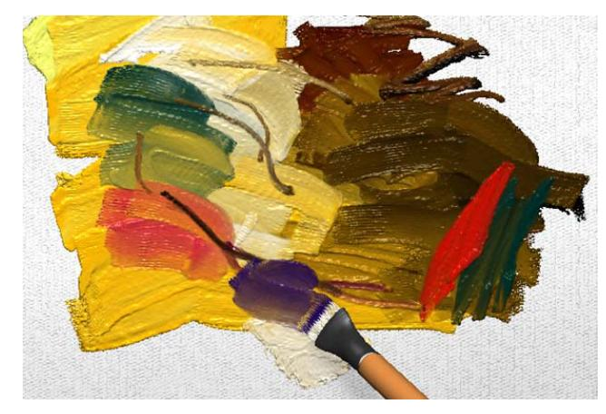

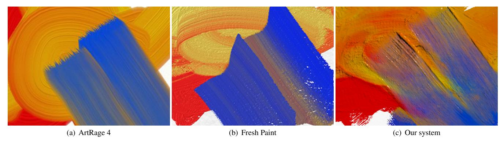

Figure 14: *The results of using di*ff*erent virtual painting systems with similar stroke patterns. Due to the use of stamp maps or 2.5 height field representations, the results of many previous painting systems, as shown in (a) and (b), do not have su*ffi*cient stroke variations as in real painting. In contrast, our system can produce fine surface details and pigment variations in each stroke, as shown in (c).*

Ando, R., Thurey ¨ , N., and Tsuruno, R. 2012. Preserving fluid sheets with adaptively sampled anisotropic particles. *IEEE Trans. Vis. Comp. Graph. 18*, 8, 1202–1214. Baxter, W., and Lin, M. C. 2004. A versatile interactive 3D brush model. In *Proceedings of Pacific Graphics*, 319–328. Baxter, B., Scheib, V., Lin, M. C., and Manocha, D. 2001. DAB: Interactive haptic painting with 3D virtual brushes. In *Proceedings of the 28th Annual Conference on Computer Graphics and Interactive Techniques*, SIGGRAPH '01, 461–468. Baxter, W., Liu, Y., and Lin, M. C. 2004. A viscous paint model for interactive applications. *Computer Animation and Virtual Worlds (CASA) 15*, 3-4, 433–441. Baxter, W. V., Wendt, J., and Lin, M. C. 2004. IMPaSTo: A realistic, interactive model for paint. In *Proceedings of NPAR*, 45–56. Becker, M., and Teschner, M. 2007. Weakly compressible SPH for free surface flows. In *Proceedings of SCA*, 209–217. Bergou, M., Wardetzky, M., Robinson, S., Audoly, B., and Grinspun, E. 2008. Discrete elastic rods. *ACM Trans. Graph. (SIGGRAPH) 27*, 3 (Aug.), 63:1–63:12. Bishop, R. L. 1975. There is more than one way to frame a curve. *The American Mathematical Monthly 82*, 3, 246–251. Boyd, L., and Bridson, R. 2012. MultiFLIP for energetic two-phase fluid simulation. *ACM Trans. Graph. 31*, 2 (Apr.), 16:1–16:12. Brackbill, J. U., and Ruppel, H. M. 1986. FLIP: A method for adaptively zoned, particle-in-cell calculations of fluid flows in two dimensions. *J. Comput. Phys. 65*, 2 (Aug.), 314–343. Chentanez, N., Muller ¨ , M., and Kim, T. 2014. Coupling 3D Eulerian, height field and particle methods for the simulation of large scale liquid phenomena. In *Proceedings of SCA*. Chu, N. S. H., and Tai, C.-L. 2002. An efficient brush model for physically-based 3D painting. In *Proceedings of Pacific Graphics*, 413–421. Chu, N., Baxter, W., Wei, L.-Y., and Govindaraju, N. 2010. Detail-preserving paint modeling for 3D brushes. In *Proceedings of NPAR*, 27–34. DiVerdi, S., Krishnaswamy, A., and Hadap, S. 2010. Industrialstrength painting with a virtual bristle brush. In *Proceedings of VRST*, 119–126. DiVerdi, S., Krishnaswamy, A., Mech, R., and Ito, D. 2013. Painting with polygons: A procedural watercolor engine. *IEEE Trans. Vis. Comp. Graph. 19*, 5, 723–735. Enright, D., Marschner, S., and Fedkiw, R. 2002. Animation and rendering of complex water surfaces. *ACM Trans. Graph. (SIGGRAPH) 21*, 3 (July), 736–744. Foster, N., and Fedkiw, R. 2001. Practical animation of liquids. In *Proceedings of the 28th Annual Conference on Computer Graphics and Interactive Techniques*, SIGGRAPH '01, 23–30. Foster, N., and Metaxas, D. 1995. Realistic animation of liquids. In *Graphical Models and Image Processing*, 23–30. Gingold, R., and Monaghan, J. 1977. Smoothed particle hydrodynamics – Theory and application to non-spherical stars. *Monthly Notices of the Royal Astronomical Society 181*, 375–389. Golub, G. H., and Van Loan, C. F. 1996. *Matrix Computations (3rd Ed.)*. Johns Hopkins University Press, Baltimore, MD, USA. Gossett, N., and Chen, B. 2004. Paint inspired color mixing and compositing for visualization. In *IEEE Symposium on Information Visualization*, IEEE, 113–118. Green, S. 2010. Particle simulation using CUDA. *NVIDIA technical report*. Harlow, F. H. 1964. The particle-in-cell computing method for fluid dynamics. *Methods in Computational Physics 3*. Hong, J.-M., Lee, H.-Y., Yoon, J.-C., and Kim, C.-H. 2008. Bubbles alive. *ACM Trans. Graph. (SIGGRAPH) 27*, 3 (Aug.), 48:1–48:4. Lee, H.-Y., Hong, J.-M., and Kim, C.-H. 2009. Interchangeable SPH and level set method in multiphase fluids. *The Visual Computer (CGI) 25*, 5–7, 713–718. Lin, W. C., Liao, W.-K., and Lee, C.-H. 2011. Simulating and rendering wet hair. In *SIGGRAPH Asia 2011 Posters*, 39:1–39:1. Lin, W.-C. 2014. Coupling hair with smoothed particle hydrodynamics fluids. In *Proceedings of VRIPHS*. Losasso, F., Talton, J., Kwatra, N., and Fedkiw, R. 2008. Two-way coupled SPH and particle level set fluid simulation. *IEEE Trans. Vis. Comp. Graph. 14*, 4, 797–804. Lu, J., Barnes, C., DiVerdi, S., and Finkelstein, A. 2013. Realbrush: Painting with examples of physical media. *ACM Trans. Graph. (SIGGRAPH) 32*, 4 (July).

Figure 15: *A creek example. By increasing the oil density in paint liquid, artists can use our simulation-based painting system to draw thin and flat paintings, as shown in this example.* Copyright c Zhili Chen, Byungmoon Kim, Daichi Ito, and Huamin Wang 2015.

- Macklin, M., and Muller ¨ , M. 2013. Position based fluids. *ACM Trans. Graph. (SIGGRAPH) 32*, 4 (July), 104:1–104:12. Muller ¨ , M., Charypar, D., and Gross, M. 2003. Particle-based fluid simulation for interactive applications. In *Proceedings of SCA*, 154–159. Muller ¨ , M., Heidelberger, B., Hennix, M., and Ratcliff, J. 2007. Position based dynamics. *J. Vis. Comun. Image Represent. 18*, 2 (Apr.), 109–118. O'Brien, J. F., and Hodgins, J. K. 1995. Dynamic simulation of splashing fluids. In *Proceedings of the Computer Animation*, 198–205. Okaichi, N., Johan, H., Imagire, T., and Nishita, T. 2008. A virtual painting knife. *The Visual Computer (CGI) 24*, 7 (July), 753–
- 763. Osher, S., and Sethian, J. A. 1988. Fronts propagating with curvature-dependent speed: Algorithms based on Hamilton-Jacobi formulations. *Journal of Computational Physics 79*, 1, 12 – 49. Rungjiratananon, W., Kanamori, Y., and Nishita, T. 2012. Wetting effects in hair simulation. *Comp. Graph. Forum (Pacific Graphics) 31*, 7 (Sept.), 1993–2002. Solenthaler, B., and Pajarola, R. 2009. Predictive-corrective incompressible SPH. *ACM Trans. Graph. (SIGGRAPH) 28*, 3 (July), 40:1–40:6. Stam, J. 1999. Stable fluids. In *Proceedings of the 26th Annual Conference on Computer Graphics and Interactive Techniques*, SIGGRAPH '99, 121–128. Stomakhin, A., Schroeder, C., Chai, L., Teran, J., and Selle, A. 2013. A material point method for snow simulation. *ACM Trans. Graph. (SIGGRAPH) 32*, 4 (July), 102:1–102:10. Strassmann, S. 1986. Hairy brushes. *SIGGRAPH Comput. Graph. 20*, 4 (Aug.), 225–232. Sulsky, D., Chen, Z., and Schreyer, H. 1994. A particle method for history-dependent materials. *Computer Methods in Applied Mechanics and Engineering 118*, 12, 179 – 196. van der Laan, W. J., Green, S., and Sainz, M. 2009. Screen space fluid rendering with curvature flow. In *Proceedings of I3D*, 91–
  - 98. Wang, H., Miller, G., and Turk, G. 2007. Solving general shallow wave equations on surfaces. In *Proceedings of SCA*, 229–238. Xu, S., Tang, M., Lau, F., and Pan, Y. 2002. A solid model based virtual hairy brush. *Comp. Graph. Forum (Eurographics) 21*, 3 (Sept.), 299–308. Zhu, Y., and Bridson, R. 2005. Animating sand as a fluid. *ACM Trans. Graph. (SIGGRAPH) 24*, 3 (July), 965–972. Zhu, B., Lu, W., Cong, M., Kim, B., and Fedkiw, R. 2013. A new grid structure for domain extension. *ACM Trans. Graph. (SIGGRAPH) 32*, 4 (July), 63:1–63:12. Zhu, B., Quigley, E., Cong, M., Solomon, J., and Fedkiw, R. 2014. Codimensional surface tension flow on simplicial complexes. *ACM Trans. Graph. (SIGGRAPH) 33*, 4 (July), 111:1–111:11. Zhu, B., Lee, M., Quigley, E., and Fedkiw, R. 2015. Codimensional non-newtonian fluids. *ACM Trans. Graph. (SIGGRAPH) 34*, 4 (July), 115:1–115:9.

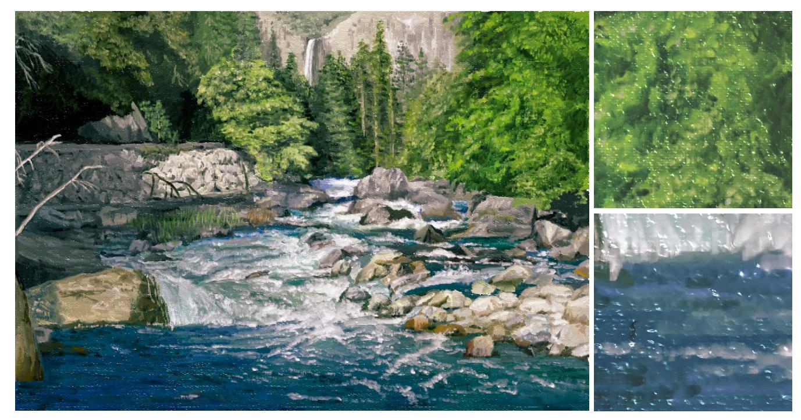