#### **ACM Reference Format**

Pirk, S., Stava, O., Kratt, J., Said, M., Neubert, B., Mech, R., Benes, B., Deussen, O. 2012. Plastic Trees: Interactive Self-Adapting Botanical Tree Models. *ACM Trans. Graph. 31* 4, Article 50 (July 2012), 10 pages. DOI = 10.1145/2185520.2185546 http://doi.acm.org/10.1145/2185520.2185546.

#### **Copyright Notice**

Permission to make digital or hard copies of part or all of this work for personal or classroom use is granted without fee provided that copies are not made or distributed for profi t or direct commercial advantage and that copies show this notice on the fi rst page or initial screen of a display along with the full citation. Copyrights for components of this work owned by others than ACM must be honored. Abstracting with credit is permitted. To copy otherwise, to republish, to post on servers, to redistribute to lists, or to use any component of this work in other works requires prior specifi c permission and/or a fee. Permissions may be requested from Publications Dept., ACM, Inc., 2 Penn Plaza, Suite 701, New York, NY 10121-0701, fax +1 (212) 869-0481, or permissions@acm.org. © 2012 ACM 0730-0301/2012/08-ART50 \$15.00 DOI 10.1145/2185520.2185546 http://doi.acm.org/10.1145/2185520.2185546

# **Plastic Trees: Interactive Self-Adapting Botanical Tree Models**

Sören Pirk1 Ondrej Stava2 Julian Kratt1 Michel Abdul Massih Said2 Boris Neubert1 Radomír Mech ˇ 3 Bedrich Benes2 Oliver Deussen1

1University of Konstanz, Germany, 2Purdue University, USA, 3Adobe Systems Inc., USA

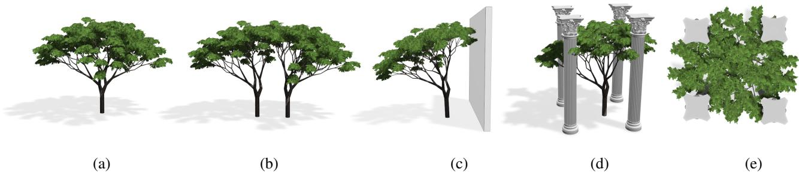

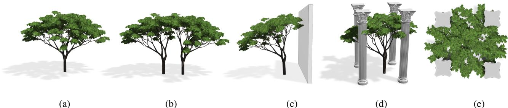

Figure 1: *A 3D model of a tree is imported (a). Our system automatically computes a dynamic model that is able to react interactively to environmental changes such as trees growing together (b) or when obstacles are moved towards the tree and cast shadow on it (c)-(e).*

## **Abstract**

We present a dynamic tree modeling and representation technique that allows complex tree models to interact with their environment. Our method uses changes in the light distribution and proximity to solid obstacles and other trees as approximations of biologically motivated transformations on a skeletal representation of the tree's main branches and its procedurally generated foliage. Parts of the tree are transformed only when required, thus our approach is much faster than common algorithms such as Open L-Systems or space colonization methods. Input is a skeleton-based tree geometry that can be computed from common tree production systems or from reconstructed laser scanning models. Our approach enables content creators to directly interact with trees and to create visually convincing ecosystems interactively. We present different interaction types and evaluate our method by comparing our transformations to biologically based growth simulation techniques.

CR Categories: I.3.5 [Computer Graphics]: Computational Geometry and Object Modeling; I.3.6 [Computer Graphics]: Methodology and Techniques—Interaction Techniques I.6.8 [Simulation and Modeling]: Types of Simulation—Visual

Keywords: Generative Tree Modeling, Interactive Procedural Modeling, Visual Models of Trees

Links: [DL](http://doi.acm.org/10.1145/2185520.2185546) [PDF](http://portal.acm.org/ft_gateway.cfm?id=2185546&type=pdf) [W](http://graphics.uni-konstanz.de/publikationen/2012/plastic_trees/website/)EB

## **1 Introduction**

Botanical tree models are used in a many application areas, including architecture, urban modeling, gaming, and movies. However, modeling the variety of tree shapes is a challenging problem because trees react to the surrounding environment in complex ways. Their shape is determined by their endogenous information (individual plants' genetics) and by exogenous influences (its environment). The same tree species that has a well-developed crown when grown in an open space might have a longer trunk and only a small tree crown when standing in a forest. The variety of plant shapes can be captured by growth models, but the growth simulation is time intensive and models require typically a large set of input parameters, which makes such approaches unsuitable for interactive design. Many different procedural tree modeling techniques have been published, but most of the resulting models are still static. If trees have to be combined, or if the environment changes, models have to be adapted manually or the procedural creation has to be rerun.

We present a dynamic modeling and representation technique for trees that aims at incorporating aspects of the trees genotype into our models to allow them to react to the environment. In the past this was only possible using growth models such as Open Lsystems [\[Mech and Prusinkiewicz 1996\]](#page-9-0) or space colonization al- ˇ gorithms [\[Palubicki et al. 2009\]](#page-9-1) that regrow the entire model and thus exhibit prohibitively long computing times. In contrast, we use a technique that approximates biologically motivated transformations and also allows computing dynamic behavior efficiently, users can interact even with dozens of complex models in a scene. Our method works with various kinds of input models that are represented as polygonal surfaces, only we assume that the models correspond to trees that were designed without the influence of other trees or obstacles. We have successfully applied our approach to models generated by Open L-systems [\[Mech and Prusinkiewicz](#page-9-0) ˇ [1996\]](#page-9-0), to manually designed models from Xfrog [\[Lintermann and](#page-9-2) [Deussen](#page-9-2) 1999], and with laser-scanned and reconstructed models.

The given models are analyzed, a skeletal graph is constructed, and a set of transformations is defined to modify the structure of this graph when the environment changes. Similar to Livny et al. [\[2011\]](#page-9-3), we represent the foliage with a number of leaf clusters that are distributed in the tree crown. Tiny twigs and leaves inside

these clusters are created procedurally using a GPU, allowing us to produce the necessary geometry very efficiently. Inspired by real trees, the change in light distribution is the most important factor for influencing our models. The illumination of different parts of the tree is determined and then used to modify their geometric structure and the procedural content of the leaf clusters.

The proposed method can be used to interactively model ecosystems consisting of up to some dozens of different trees. An example is shown in Figure [1.](#page-0-0) It has been procedurally created and then imported into our system. The automatic adaptation of our tree models to changing environmental factors releases the modeler from dealing with tree parameters and allows them to construct complex scenes very quickly. Because most of the geometry of our models can be created on the fly using graphics hardware, the models can also be used in real-time scenarios such as games or simulators.

## **2 Related Work**

Early models of plants were based on procedural approaches that replicated growth by repetitive application of a small set of rules to an initial structure to yield very complex results. Originally, the rules captured only the internal properties of the tree, such as branching angles and internode lengths [\[Aono and Kunii 1984;](#page-7-0) [Honda 1971;](#page-9-4) [Kawaguchi 1982;](#page-9-5) [Oppenheimer 1986;](#page-9-6) [Smith 1984\]](#page-9-7). Later, more geometrical aspects such as textures and detailed branches were added [\[Bloomenthal 1985\]](#page-7-1), and various biological developmental models were introduced [\[de Reffye et al. 1988\]](#page-9-8). However, the shape of the trees in these approaches can be controlled only indirectly by using the parameters of the procedural models. Another class of methods includes user-assisted plant modeling. One of the first of these approaches was the work of Weber and Penn [\[1995\]](#page-9-9), who created convincing tree models using a complex parametric model. [\[Boudon et al. 2003\]](#page-9-10) introduce decomposition graphs as multiscale representations of plant structures to aid user control. Lintermann and Deussen [\[1999\]](#page-9-2) developed the Xfrog modeling technique, which combines rule-based and procedural modeling and also allows for creating animated models. Here, parametric keyframes of a model are determined–sets of parameters for a specific time–and later interpolated to create growth animations of trees. However, it is not possible for models to dynamically react to their environment.

Image-based techniques use sets of images to produce tree models. While Reche-Martinez et al. [\[2004\]](#page-9-11) have to register their input images carefully and reconstruct the 3D shape of the tree from the photographs, the method of Neubert et al. [\[2007\]](#page-9-12) works with loosely arranged images. Here, the main branches are determined by the user and the static model is constructed using a particle flow system and some botanic heuristics. Ijiri et al. [\[2006\]](#page-9-13) and Zakaria and Shukri [\[2007\]](#page-9-14) applied sketch-based methods to trees generated by procedural techniques, bridging the area of rule-based and image-based techniques. Chen et al. [\[2008\]](#page-9-15) used a set of biologically motivated branching rules to infer the 3D structure of the tree model from a given 2D sketch (also [\[Okabe et al. 2006\]](#page-9-16)). Deussen and Lintermann [\[2005\]](#page-9-17) give a general overview on the various techniques.

It has been recognized that the environment plays an important role in the development of a tree [\[Sachs and Novoplansky 1995\]](#page-9-18). Modification of the environment itself can be used as a way of controlling the procedural model. Arvo and Kirk [\[1988\]](#page-7-2), Greene [\[1989\]](#page-9-19), and later Benes and Millan [\[2002\]](#page-7-3) simulated climbing plants that grow on support structures and are influenced by the light density in subvolumes of the scene. Various methods for computing light within trees have been proposed, such as the fast, but simplified, technique proposed by Rudnick et al. [\[2007\]](#page-9-20), where the light was estimated from the crown shape, or a more advanced method based on radiant energy transfer [\[Soler et al. 2003\]](#page-9-21).

Hart et al. [\[2003\]](#page-9-22) simulated the production of additional wood when a tree receives mechanical stress to its parts. [\[Lam and King 2005\]](#page-9-23) go even further and propose a method that models tree growth based on the interaction of the tree's internal attributes also considering water distribution and chemical flow. A GPU-oriented approach for modeling trees under the influence of environment was introduced in [\[Benes et al. 2009\]](#page-7-4); however, the expressive power of their growth model was limited only to a few decideous tree species.

Probably the most developed formal systems for plant simulation are Lindenmayer systems (L-systems). Originally developed as a mathematical model for cell development [\[Lindenmayer 1968\]](#page-9-24), Lsystems were extended by the ability to simulate branching structures in [\[Prusinkiewicz 1986\]](#page-9-25), and were later extended in various ways to enable animation of plant development [\[Prusinkiewicz](#page-9-26) [et al. 1993\]](#page-9-26), interactive modeling [\[Power et al. 1999;](#page-9-27) [Prusinkiewicz](#page-9-28) [et al. 2001\]](#page-9-28), etc. One of the most important extensions, Open Lsystems [\[Mech and Prusinkiewicz 1996\]](#page-9-0), account for environmen- ˇ tal feedback between the plant and its environment making it possible to simulate the effects of competition for light. This competition for resources was further developed using space colonization algorithms [\[Runions et al. 2007\]](#page-9-29) that controlled the growth mostly by distributing resources in the environment. Recently, realistic rulebased models of trees have been created by techniques in which the competition for resources plays an important role [\[Palubicki et al.](#page-9-1) [2009;](#page-9-1) [Hua and Kang 2011\]](#page-9-30). Still, most of these techniques rely on growth models, which makes them impractical for interactive design.

## **3 System Overview**

The effect of the environment on the youngest parts of the tree is usually not visible, as those parts have not had enough time to develop. This motivated us to simulate the effect of the environment mostly on the trunk and the main tree branches (the tree skeleton). This approach is similar to the idea of Livny et al. [\[2011\]](#page-9-3), who separated the input tree model into a main branching skeleton that is handled directly and a set of lobes that are filled with smaller branches and twigs procedurally on the fly. In our approach, we input a tree model that was created as if it was grown in an open space and convert it into a graph-based representation and a set of leaf clusters. In contrast to their work, we have a complete tree model and can directly use small twigs as prototypes for the procedural filling, and thus our approach is independent of a tree model library with predefined content. This approximate representation is the key for fast interaction with the environment and an efficient rendering of tree models while maintaining their visual fidelity.

A tree shape is a result of the competition for resources, the most important of which is light [\[Sachs and Novoplansky 1995\]](#page-9-18). If a tree has been grown close to an obstacle, changes in the plant shape, such as bending or shedding, can occur. These effects are simulated by our dynamic models.

The two parts of our models react differently to environmental changes. The main branching skeleton is bent and pruned according to the light distribution. When the local light distribution changes, the procedural content of the leaf clusters is modified. Small branches and twigs bend towards the light and can be pruned if the lobes interact with a solid obstacle. The shape of the lobes can be deformed when the tree is bent, which also affects the procedural content.

The remainder of the paper is organized as follows. In the next section we describe the necessary prerequisites for our method

and the processing of the input models. Section [5](#page-4-0) outlines our transformation-based modeling and interaction as well as their efficient implementation. An evaluation of the method is given in Section [6,](#page-5-0) where we show a number of results and compare them to rule-based systems that allow for interaction with an environment.

#### **4 Tree Analysis**

The response of individual branches and the sensitivity of the given input tree to changing environmental conditions is calculated from the tree's geometrical and topological information. Therefore, we assume that it should have been grown in an isolated space with no external obstacles. However, the shape of the input tree is affected by self-shadowing even when external obstacles are not present. To account for this effect, we first estimate the environmental conditions that influenced the tree structure, and then we estimate its intrinsic morphological properties. We use these properties to construct a procedural model that defines the behavior of each branch. This model is controllable by a set of environmental parameters and thus is able to react dynamically to environmental changes.

To estimate morphological parameters of the tree branches, such as their desired orientation or their response to insufficient amounts of light, we first need to estimate the environmental conditions that affected the structure of the input tree. As mentioned above, we concentrate on the light distribution since this is the most important factor for the tree growth. For our input models we assume that the light distribution is affected only by the tree itself: leaves and branches cast shadows that influence the growth of underlying branches.

The shadows within a tree are changing during the tree growth because new branches and leaves are constantly created and old ones die off. In order to estimate the growth parameters of the input tree, we need to compute the temporal light conditions at different stages of its growth. Such light conditions affect the local growth rates of branches and thus can be revealed from them.

#### **4.1 Computing the Branch Age**

An estimate of the branch age can be determined if we know the growth rates across the entire tree. The growth rate of an individual branch is determined by how many internodes (segments without buds) a given branch produces in one season. This growth rate can vary across the tree, as it is influenced by the amount of resources that a given branch receives during its growth. Therefore, to compute an approximate of the branch age we need to estimate both the internode length and the growth rate of individual branches of the tree (cf. Figure [2a](#page-2-0)).

The length of an internode li is estimated from the distribution of distances between nearest branching nodes. We use the mean internode length for our estimation which is then the most significant peak point in the distribution that is found using mean-shift clustering. To estimate the growth rate νs of a given branch segment s, we first compute a relative growth rate νˆs as:

$$\hat{\nu}_s = \frac{d_{s,l}}{d_r - d_{s,r}}, \quad (1)$$

where ds,l is the distance from a given segment to its furthest leaf node, ds,r is the distance from the segment to the root of the tree, and dr is the distance from the root of the tree to its furthest leaf node. The computed value specifies how much slower a given branch has to grow compared to the fastest growing branch in order to ensure that all branches reach their leaf nodes at the same time. The estimation of the relative growth rate loses its accuracy as we move closer to the leaf nodes; therefore, we use the above estimation only for segments whose distance to the leaf node is larger than a threshold distance dt = 0.2dr. For the remaining branch segments, we copy the relative growth rate from their parent branches.

When the relative growth rate is estimated for all branches, we compute the absolute growth rate νs = ˆνs/νˆmin, where νˆmin is the minimum relative growth rate from all branch segments. The age of each branch ts is then computed as

$$t_s = \frac{l_s}{l_i} \nu_s + t_{sp}, \quad (2)$$

where ls is the length of the branch segment and tsp is the age of its parent branch. The final estimated age of each branch segment is then clamped to the nearest lower integer, which represents the season in which a given branch segment was created.

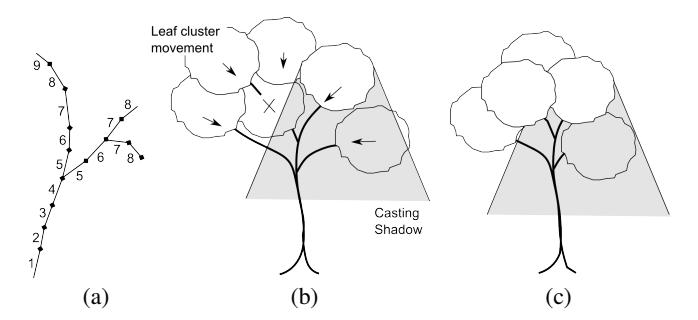

Figure 2: *Estimation of the light exposition during growth. a) Determination of branch age; b) input model with leaf clusters; c) computed younger version with moved and partially removed leaf cluster.*

#### **4.2 Temporal Light Conditions**

Once the branch age is known, we can estimate the light conditions for the different stages of the tree growth. It would be infeasible to simulate the effect of each leaf individually; therefore, we approximate the leaf distribution by virtual leaf clusters. The initial clusters are created from the lobes of the input tree. The clusters cast shadows onto the rest of the tree using a simplified light model that accounts for the typical incident light within a day as proposed by Palubicki et al. [\[2009\]](#page-9-1). Although advanced illumination models for plants exist [\[Soler et al. 2003\]](#page-9-21), we use a simplified model suitable for fast calculation. To compute the light received at a given point p, we integrate the incoming light from a hemisphere that represents the sky:

$$i(\mathbf{p}) = c \int_0^{2\pi} \int_0^\pi I(\theta, \phi) (1 - O(\mathbf{p}, \theta, \phi)) \sin \theta \, d\theta d\phi, \quad (3)$$

where I is the amount of light coming from a specific direction (irradiance) and O is the visibility of the hemisphere from the given point p that is determined by the combined translucency γ of all obstacles that are in the given direction Q O(p, θ, φ) = 1 − γ(p, θ, φ). Finally, c is a normalization constant that brings the amount of incoming light into range [0, 1]. The same approach is also used to compute the average light direction, where the integrand in the above equation is multiplied by a unit vector defined by (θ, φ).

In this work, we approximate the intensity of the light coming from the sky by using I(θ, φ) = cos2 (∆σ(θ, φ)), where ∆σ is the angular distance between a given direction (θ, φ) and the direction of the brightest point on the sky.

The shadows are computed and integrated into the scene using shadow volumes that are attached to each shadow caster. Shadow volumes represent a volume where the influence of the shadow caster is still significant, and they are used to quickly determine which obstacles should be included in Eq. [\(3\)](#page-2-1). Since we use only simple geometric shapes for the obstacles, we are able to evaluate the light model analytically; for more complex cases a numerical solution might be employed such as one used in [\[Mech and](#page-9-0) ˇ [Prusinkiewicz 1996;](#page-9-0) [Soler et al. 2003\]](#page-9-21).

To determine the intensity of cast shadows, the translucency of the leaf clusters γc is approximated from their radius rc as:

$$\gamma_c = \gamma_{c_0}^{r_c}, \quad (4)$$

where γc0 is the base unit translucency of a leaf cluster. We use a rough species-independent approximation with γc0 = 0.5, while knowing that different species differ in their translucency.

To compute the light conditions at earlier stages of the tree life, we propagate the leaf clusters towards the root as illustrated in Figure [2b](#page-2-0)). At each iteration we decrease the active threshold age by one, and we remove all nodes that are older than the threshold. The leaf clusters that contained the removed nodes are then propagated to the nodes that are now leaves. The center of each cluster cn is determined by the centroid of the nodes assigned to it; the radius of a new cluster rn is estimated from the properties of the set of removed leaf clusters in child nodes Cp as:

$$r_n = \sqrt[3]{\sum_{i \in C_p} r_i^3 \prod_{i \in C_p} \frac{d_n}{d_i}}, \quad (5)$$

where ri is the radius of a single child cluster, di is the distance from the root to the centroid of child leaf cluster i and dn from the root to the new leaf cluster. The new leaf cluster has the combined volume of all child leaf clusters scaled down by the relative difference of their distances to the root of the tree.

#### **4.3 Inverse Tropism**

Once the environmental conditions at different stages of the tree's development are known, we can calculate the effects of the environment on the shape of the input tree. The first effect we are able to compute is the influence of tropisms on the tree growth. A tropism is the tendency of the branches to grow towards or away from some entity. In general the structure of the tree can be affected by different tropisms where each tropism τ is defined by a vector ~t 0 τ = wτ ~tτ , where ~tτ is the unit direction of the tropism and wτ is its strength.

In this work, we focus on phototropism and gravitropism. Phototropism is the tendency of a given branch to grow towards the light direction. We estimate the effects of phototropism for each branch at the time the branch was growing using our temporal light model described above. Gravitropism controls bending of the branches either away from or towards gravity. While we compute the strength of the tropisms directly from the input tree, we later expose it as a parameter that the user can modify to control the transformation behavior of the trees.

A tropism that acts on a branch segment (growing in normalized direction d~o) bends the branch into a new direction ~h, which is computed as:

$$\vec{h} = w_s \vec{d}_o + (1 - w_s) \frac{\sum w_\tau \vec{t}_\tau}{\sum w_\tau} = w_s \vec{d}_o + (1 - w_s) \vec{t}, \quad (6)$$

the branch segment with length ls. This weight can be determined by:

$$w_s = \left(1 - \sum w_\tau\right)^{\frac{l_s}{l_i}}, \quad (7)$$

where the exponent represents the accumulated effect of tropisms over the length of the branch segment, normalized by the internode length li.

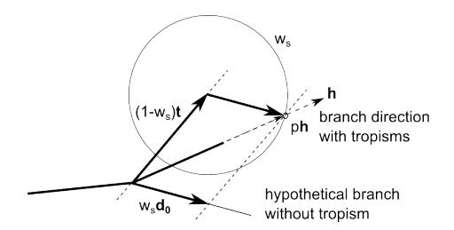

Figure 3: *Computing the inverse tropism. For a description of the vectors please refer to the text.*

In order to compute the effects of tropisms on the input tree when its environment is changed, we first need to find the effects of tropisms on the structure of the tree at the time when it was created. We refer to this problem as computing the *inverse tropism* since our inputs are branches that have been already bent, and we try to find out what branches would look like if effects of tropisms were removed.

Computing the inverse tropism means solving Eq. [\(6\)](#page-3-0) for d~o with known ~h, defined by the orientation of the branches in the input trees. The actual length of ~h in Eq. [\(6\)](#page-3-0) can vary because it is computed from a linear combination of different vectors. Therefore, we have to modify Eq. [\(6\)](#page-3-0) by introducing a line parameter p:

| $w_s \vec{d}_o = p \vec{h} - (1 - w_s) \vec{t}$ | (8) |
|-------------------------------------------------|-----|
|-------------------------------------------------|-----|

This equation has the following geometric interpretation (see Figure [3\)](#page-3-1): we look for a direction of a vector wsd~0 that when added to (1 − ws)~t results in a vector that lies on a line defined by ~h. The line parameter p, for which the vector d~o, has a unit size, can be found if we intersect the line with a sphere that has radius equal to ws. The parameter p is then the maximal solution to the following quadratic equation:

$$w^2 = p^2 |\vec{h}|^2 - 2p(\vec{h} \cdot \vec{t}_w) + |\vec{t}_w|^2, \quad (9)$$

where ~tw = (1 − ws)~t.

If Eq. [\(9\)](#page-3-2) does not have a solution, we use the first derivative of it to compute a value of p that defines the point on the line that is closest to the sphere. This value is then inserted into Eq. [\(8\)](#page-3-3) to compute the vector d~o. Knowing this direction for every branch segment of the input tree, we can use Eq. [\(6\)](#page-3-0) to adjust the bending of the branches when the environment changes.

#### **4.4 Pruning Estimation**

Natural pruning influences the tree structure of most species and therefore it is crucial for us to determine when a given branch should be pruned. We express this in terms of the resources (photosynthates) gathered by the tree from the light. Please note that we cannot capture topiary.

for a long period of time, it slows down its activity. A branch that does not receive light for a longer period of time eventually dies off.

We use an approach similar to [\[Palubicki et al. 2009\]](#page-9-1), where the pruning of a branch is computed based on the sum of node distances to all leaf nodes lt and the amount of resources gathered by their child leaf clusters ζt. A branch is pruned when the ratio ζt/lt is smaller than some threshold value called *pruning factor* ψ. For a given branch segment s, the gathered amount of resources ζts is computed from the light that is received on the leaf clusters Cs that are located on the child nodes of a branch segment s:

$$\zeta_{t_s} = \sum_{c \in C_s} 2\pi r_c^2 i c, \quad (10)$$

where rc is the radius of a given leaf cluster and ic is the normalized amount of light that the cluster receives.

Since the input to our method is an already grown tree where the branches have been pruned, we cannot compute the pruning factor ψ directly. Instead, for a branch segment s we compute a local pruning factor ψs(t) for every stage of the tree growth t. The local pruning factor allows us to determine the minimum pruning factor when a given branch was not shed during growth. Since we can only compute a rough approximation, we use the fifth percentile of the distribution of all ψs(t) as our reference pruning factor ψref . This allows us to receive an estimation. The individual pruning factor is now computed for every branch s by

$$\psi_{s_{min}} = c_\psi \min(\psi_{ref}, \min_{\forall t}(\psi_s(t))), \quad (11)$$

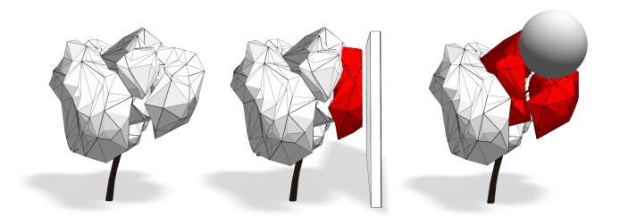

where cψ is a user-controllable parameter that determines the strength of the pruning. We use a default value cψ = 0.8.

### **5 Dynamic Interaction**

After analyzing the input tree to estimate growth behavior and pruning strength, we can efficiently model the interaction with its environment. During the interaction we first calculate the amount of changes in the environment; the tree response is then expressed by transforming the main branches by updating the shape of the leaf clusters and by modifying their procedural content.

#### **5.1 Tree Graph Transformations**

The transformations should represent changes in the tree growth. We transform individual branch segments according to their estimated age (Section [4.1\)](#page-2-2) and as a reaction to the new light conditions using our temporal light model.

The direction of the incident light is used to generate the bending transformation from Eq. [\(6\)](#page-3-0). The rotation of a branch segment is propagated to its child branches. When a branch is transformed, it is also necessary to update its associated leaf clusters that may cast shadows onto younger branches.

The pruning transformations are computed after all branches of a given age have been transformed. When all branches on level t have been transformed, we compute the resource allocation ζts for all branches with ages between 0 and t (see Eq. [\(10\)](#page-4-1)). The resources are then compared with the total length of all existing child branches and the pruning factor ψs(t) is computed. All branches (and their children) with resources smaller than ψsmin are pruned.

#### **5.2 Modeling of Leaf-Clusters**

In order to simulate a cluster's response to light, we first calculate the amount of light each cluster receives. This information is then used to adjust the creation of branches within a cluster, their orientation, and the number of leaves per branch. As described by Livny et al. [\[2011\]](#page-9-3), procedural creation is a repeating process of adding branchlets (small branches obtained from the input model) to some initial seed points of the leaf cluster on the main branching skeleton. We parameterize this process by the desired cluster density.

The relationship between the incoming light i and the normalized density ρl is denoted by

$$\rho_l = \frac{\rho_{l_0}}{\rho(i_{l_0})} \rho(i). \quad (12)$$

for leaf cluster l with an initial density ρl0 for the initial light valueil0 .

When a leaf cluster collides with an obstacle it is intersected as shown in Figure [4.](#page-4-2) We adjust the selection of branchlets according to the new hull of the cluster on a frame-by-frame basis. Please note that due to the approximate nature of cluster filling, small branches sometimes grow out of the hull and thus might enter an obstacle. We do not prune such branches so far since we found this effect negligible, but in the future this might be added.

If the object is not solid (e.g., another tree model), the clusters are not intersected but overlap and share the space. This way we are able to achieve convincing branch canopies for close tree models (cf. Figure [11\)](#page-8-0).

Figure 4: *Lobe intersection after a collision with solid obstacles.*

When a branch is bent or pruned away, the associated leaf clusters (filling geometry and also the envelope shape) are updated. The position of all leaf clusters is updated by computing the average offset of all their nodes from their initial position. This offset is then added to the cluster centroid.

If parts of the tree graph that belong to a cluster are removed, the respective seed points are removed, the procedural filling of the lobe is updated, and its translucency γc is updated:

$$\gamma'_c = \gamma_c^{\frac{n_c}{n_0}}, \quad (13)$$

where nc is the current number of existing nodes and n0 is the initial number. If all nodes of a cluster are removed, the leaf cluster itself is deleted.

#### **5.3 Types of Interaction**

The above-described transformations allow three types of interaction representing the most common scenarios that can be encountered during modeling: tree–obstacle interaction, tree–tree interaction, and global light interaction.

*Tree–obstacle interaction* occurs when a tree is moved close to an obstacle or vice versa. The obstacle then becomes a part of the environment that influences the tree by casting a shadow for the entire life span of its growth.

*Tree–tree interaction* is triggered when two or more trees are moved so close to each other that their mutual shadows influence their growth. For a proper simulation of this kind of interaction, we process the transformations of individual branches in all involved trees in parallel. Branches are processed according to their age. If the maximal age of a tree is higher than its competitors, we change the processing time for the branches of the younger trees in order to end up at the same completion time for all trees.

*Global light interaction* represents changes in the global light conditions of a scene. Such changes might happen when we move the scene from a southern hemisphere to a northern one or when the orientation of the scene is altered. Such changes are represented by altering the direction I(θ, φ) in Eq. [\(3\)](#page-2-1). Whenever global light conditions change, we need to recompute the transformations for all trees.

In most scenarios the above interactions happen at the same time. For example, when we move a wall into a forest then the wall transforms nearby trees, which in turn might affect the shape of their neighboring trees.

### **6 Evaluation**

Since trees grown in static conditions exhibit a large amount of randomness, we compare the underlying tree graphs of simulated versus transformed trees. We use the approach of Ferraro et al. [\[Fer](#page-9-31)[raro and Godin 2000\]](#page-9-31) that builds upon the constrained edit distance between unordered labeled tree graphs [\[Zhang 1996\]](#page-9-32). Dissimilarity between two tree graphs can be measured as an edit distance between them–the weighted minimum amount of operations that would convert one graph into the other. The possible edit operations are i) deletion of a node (the children of the node become the children of the parent node and the node is deleted), ii) node insertion (inverse of deletion), or iii) changing a node (which assigns a new label to the node). The cost of each edit operation depends on the particular application; in our approach the cost is proportional to the branch thickness (which is related to its age).

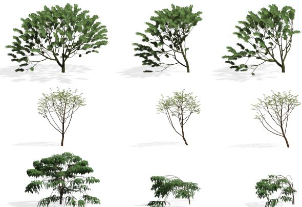

It would be impractical to compare our models to real trees because it is difficult to correctly estimate their environmental conditions. Therefore, we use trees created by a growth model proposed by Palubicki et al. [\[2009\]](#page-9-1). In order to compare the trees, we first create solitary tree models using the growth model and use them as an input for our system. We created three types of trees that differ in their tropisms. Tree 1 presents 0.25 phototropism and 0.12 gravitropism, the tropisms for Tree 2 are 0.45 and 0.44, rsp. and Tree 3 presents 0.03 phototropism and 0.23 gravitropism. The first two trees are the same age and present the same pruning factor. The last tree is older having a smaller pruning factor. We created three tree sets for each tree type:

- Set *O*: Trees created using the growth model with no obstacles where only light and self-shadowing influences the growth.
- Set *G*: Trees with the same growth parameters as *O* grown using the growth model close to a wall.
- Set *T*: Trees with the same growth parameters as *O* with the shape calculated using our system under the same conditions as *G*.

Four different groups of fifty values each were computed. The values represent distances between pairs of trees selected from the sets described above so that no tree was used twice. The different groups were *T-T*, *T-O*, *T-G*, and *G-G*. The letters represent the groups for the pairs of trees that were compared.

In order to show that there is no significant difference between the

transformed trees from set *T* and the trees grown by the growth model from set *G*, we performed a two-tailed t-test between the *T-G* and *G-G* with an alpha of 0.05. To show that the transformed trees from set *T* are significantly different to the trees from *O*, a ttest is performed between groups *T-O* and *T-T*. Table [1](#page-5-1) summarizes the obtained results.

This suggests a significant difference between trees grown without constraints versus trees next to a wall. On the other hand, there is no significant difference between the adapted trees grown with the growth model and the trees transformed with our approach under the same conditions.

| Groups             | T-G    | G-G    | T-O    | T-T     |
|--------------------|--------|--------|--------|---------|
| Mean Type          | 236.29 | 229.65 | 347.19 | 225.38  |
| Standard Deviation | 35.27  | 52.71  | 91.33  | 33.94   |
| p-value            | p      | = 0.46 | p      | < 0.001 |
| Mean Type          | 431.73 | 396.81 | 471.63 | 413.64  |
| Standard Deviation | 112.79 | 71.32  | 70.65  | 90.76   |
| p-value            | p      | = 0.06 | p      | < 0.001 |
| Mean Type          | 756.27 | 841.79 | 927.64 | 550.63  |
| Standard Deviation | 266.84 | 239.57 | 207.85 | 83.33   |
| p-value            | p      | = 0.13 | p      | < 0.001 |

Table 1: *Results obtained for the different groups T-T, T-O, T-G and G-G. The letters represent the groups for the pairs of trees that were compared.*

Figure 5: *Visual comparison of three tree models.*

Furthermore, Figure [5](#page-5-2) shows a visual comparison of the changes obtained by the growth model and our transformations. The models were grown in an open space and then imported to our system (left). Next, they were grown in different light conditions using the growth model (middle) and also transformed using our approach (right column).

### **7 Implementation and Results**

Our system is implemented in C++ using OpenGL and GLSL. All examples in this paper were generated on a desktop computer equipped with Intel i7 CPU @ 3.7GHz with 16GB of memory. Most of the rendering was done directly on the GPU (Nvidia GeForce GTX 580 with a 1.5GB of dedicated memory).

The visual appearance of our tree models is mostly determined by the structure of their main branches and not by the exact structure of leaf clusters. We therefore define a threshold for the thickness of branches that determines whether a given branch should be rendered or not. All branches with a thickness above the threshold are

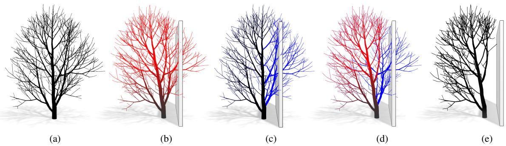

Figure 6: *The environmental effect of a shadow cast by a wall. The color represents the difference between the input tree (a) and the transformed versions. The amount of bending expressed in red (b), pruned branches colored blue (c), both transforms (d), the final model (e).*

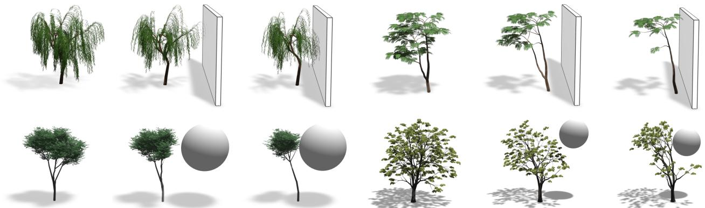

Figure 7: *Different tree models (LiDAR, Xfrog) exposed to changing conditions. As the obstacle moves close, the tree bends its shape, and some branches are pruned.*

stored in a tree graph, while the smaller branches are removed from the tree and converted into the leaf-clusters. To interact with large amounts of tree models in real time, we apply a set of level of detail (LOD) techniques. Similar to Livny et al. [\[2011\]](#page-9-3), the amount of produced geometry depends on the cluster size, the light situation, and the LOD stage. If the tree is far away from the camera, only a small subset of leaves is produced and scaled according to stochastic pruning, as introduced by Cook et al. [\[2007\]](#page-9-33). We render the tree foliage with alpha to coverage; an efficient method for layers of textures containing large numbers of transparent texels.

Since trees exhibit a large amount of self-similarity, we are able to approximate the leaf clusters using small subsets of branchlets (branch patches) that are instantiated. A set of branchlets from the input model is used to populate the volumes. These patches are stored in a texture buffer on the GPU, and the main branching structure and the patch geometry of the leaf clusters are combined to make a complete graph of the tree.

To be able to apply the transformation to the tree graph, we store the main branching structure on the CPU memory that is mapped to a frequently updated vertex buffer object on the GPU. The geometry of the skeleton is represented by generalized cylinders. To allow rendering of many tree models, we adjust the graph and mesh generation on a frame-by-frame basis.

Table [2](#page-6-0) shows a comparison of construction times using Open Lsystems and our transformations. Twenty models per group of tree ages 10, 20, and 30 were grown with an Open L-system, leading to an increasingly complex geometry. The growth times were recorded and averaged. Another three groups of twenty trees were

Table 2: *Complexity and simulation time for tree in different ages.*

|    | Tree age | Average nodes |          | Growth |       | Transforms |
|----|----------|---------------|----------|--------|-------|------------|
| 10 | years    | 530           | 216.3    | ms     | 3.82  | ms         |
| 20 | years    | 2541          | 8855.6   | ms     | 50.5  | ms         |
| 30 | years    | 9134          | 61,843.9 | ms     | 222.8 | ms         |

input in our system and the transformation times were recorded. It is important to note that the simulation applies to the regrowth of the entire tree from scratch, while the transformations are applied only in the affected areas. Generally, our approach is two orders of magnitude faster.

#### **7.1 Results**

The first example in Figure [6](#page-6-1) demonstrates the environmental effect of the shadow cast on a tree by a wall. A tree model grown in open conditions is compared with transformed models, and the amount of displacement of each node is expressed as color. As expected, the biggest change is on the tip of the tree because the error accumulates through the main skeleton.

Figure [7](#page-6-1) shows three different species–(a) Willow, (b) Delonix, and (c) Mahogany with their reaction to an obstacle. The original trees were reconstructed from LiDAR scans using the approach of [\[Livny](#page-9-3) [et al. 2011\]](#page-9-3). The trees react to the proximity of the shadow by bending away (light seeking) and by shedding branches that are close to the wall. Figure [9](#page-7-5) shows the results for two Xfrog models.

Figure 8: *A small ecosystem demonstrating various input models interacting. We have used models generated by Open L-systems, Xfrog, and LiDAR reconstructed trees in this example.*

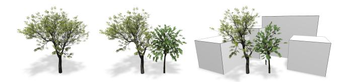

Figure 9: *Xfrog Tree models interacting to changing environmental conditions.*

So far we have demonstrated the typical European and North American trees. More special trees are palm trees or pines, as shown in Figure [10.](#page-8-0) Their graph structure has no lateral branches, it is a line for the main branches and another line through each of the leaves; the lobes cannot be applied here. The models were generated using Xfrog, and their reaction to the environment is still expectable. The palm tree bends in the direction opposite to the shadow in an attempt to capture more light. Pine trees usually do not bend and only react to the lack of light for lower branches. As expected, our model prunes low branches while maintaining a complete branching structure at the top.

Some different input models (Open L-systems, Xfrog, LiDAR scan) are shown in Figure [8,](#page-7-6) a frame from the accompanying video. The trees are affected by mutual shadowing as well as by the walls enclosing them from two sides. The branches in the ecosystem fill the available space as they would in the case of a real ecosystem.

The example in Figure [11](#page-8-0) shows two mahogany trees modeled in Xfrog that are moved close to each other. The competition for resources lets a single crown emerge in which each tree contributes in part. Figure [13](#page-8-0) shows a quad that is moved into a forest. Though we are not able to show such big scenes with all interactions and transformations interactively any more (this scene has 5 fps on our machine), the tree shapes adapt convincingly and the user is still able to interact with the scene.

### **8 Conclusion**

We presented a dynamic model representation and interaction method for complex tree models. All kinds of polygonal input models can be converted into our representation. We estimate the influences of tropisms and other environmental effects such as shadowing of the input model. When the models are created they react to obstacles and changes in the lighting. An efficient implementation allows us to manipulate even complex scenes at interactive rates.

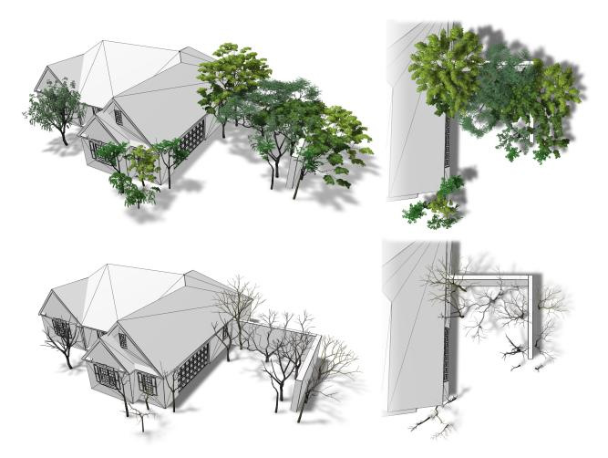

Our method, however, so far does not allow the production of new branches for the main skeleton: we always deform and manipulate the given basic structure. Furthermore, the input is limited to solitary tree models since so far we cannot hypothesize branches of the main skeleton that eventually died off. An example (Figure [14](#page-7-7) left) shows a LiDAR scanned and reconstructed tree that has already been severely modified either by some early age trauma or by growing close to an obstacle. This tree shows an unnatural bending towards the obstacle that is partially alleviated by the transformations, but still prevails as the main growth direction. The resulting tree (Figure [14](#page-7-7) right) does not seem very natural.

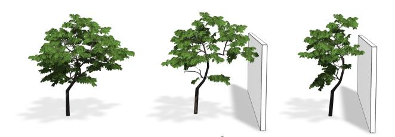

Figure 14: *A tree reconstructed from LiDAR data that is already bent. Such models often cannot be altered properly.*

We are also limited in the effects we are able to integrate. So far we included environmental factors such as light and tropisms, but no wind effects or nutrition changes in the soil. Furthermore, the system could be evaluated better by comparing it to real-world trees.

Another limitation is that our system needs some user-defined parameters, such as the amount of newly added tropism for the tree models. So far we also do not have a general-purpose GPU-based modeling process for the procedural content. We use a pre-defined species library for the parameters that allows us to produce a number of foliage types, but not all.

#### **Acknowledgements**

We thank the anonymous reviewers. This work was supported by the DFG Research Training Group GK-1042 "Explorative Analysis and Visualization of Large Information Spaces", University of Konstanz, by NSF IIS-0964302 Integrating Behavioral, Geometrical and Graphical Modeling to Simulate and Visualize Urban Areas and Adobe Inc. grant Constrained Procedural Modeling.

### **References**

AONO, M., AND KUNII, T. 1984. Botanical tree image generation. *IEEE Computer Graphics and Applications 4(5)*, 10–34. ARVO, J., AND KIRK, D. 1988. Modeling plants with environment-sensitive automata. In *Proceedings of Ausgraph '88*, 27–33. BENES, B., AND MILLÁN, E. 2002. Virtual climbing plants competing for space. In *IEEE Proceedings of the Computer Animation 2002*, IEEE Computer Society, N. Magnenat-Thalmann, Ed., 33–42. BENES, B., ANDRYSCO, N., AND ŠTAVA ˇ , O. 2009. Interactive modeling of virtual ecosystems. In *Eurographics Workshop on Natural Phenomena*, Eurographics Association, 9–16. BLOOMENTHAL, J. 1985. Modeling the mighty maple. *SIG-GRAPH Computer Graphics 19*, 3, 305–311.

Figure 10: *Special tree models interacting with obstacles.*

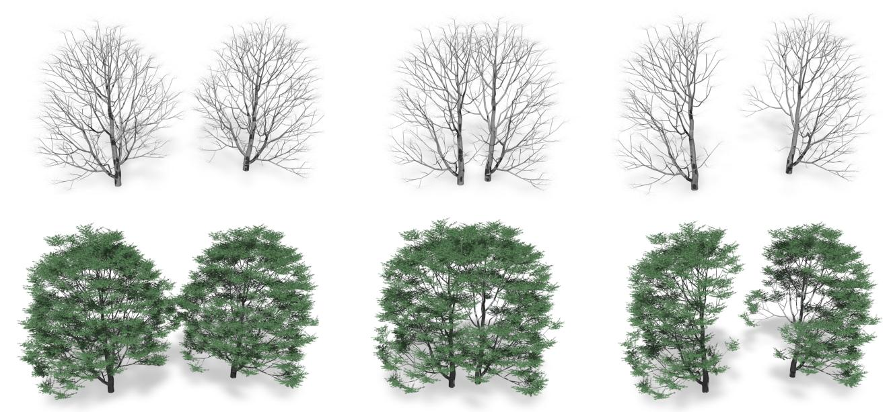

Figure 11: *Two procedurally generated trees that have been grown very close to each other form a crown that resembles a single tree.*

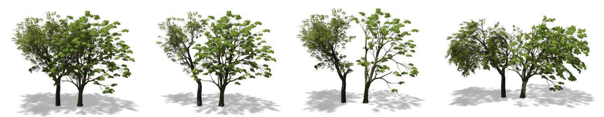

Figure 12: *Two Xfrog trees (left to right): static; combination of bending and pruning; strong pruning; exaggerated bending.*

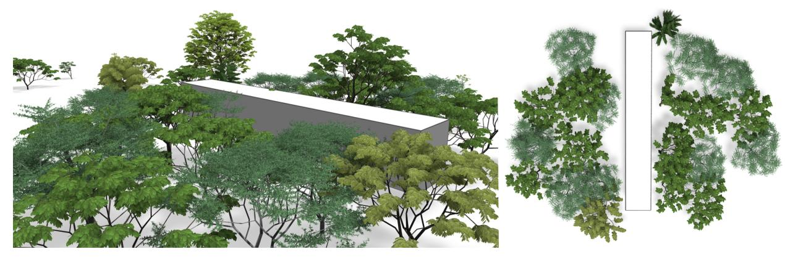

Figure 13: *Influence of an obstacle moved into a dense ecosystem.* ACM Transactions on Graphics, Vol. 31, No. 4, Article 50, Publication Date: July 2012

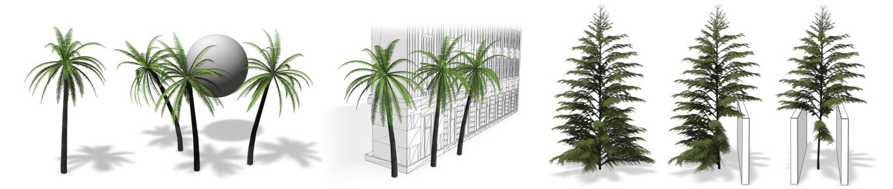

- BOUDON, F., PRUSINKIEWICZ, P., FEDERL, P., GODIN, C., AND KARWOWSKI, R. 2003. Interactive design of bonsai tree models. *Computer Graphics Forum. Proceedings of Eurographics 22*, 3, 591–599. CHEN, X., NEUBERT, B., XU, Y.-Q., DEUSSEN, O., AND KANG,
- S. B. 2008. Sketch-based tree modeling using markov random field. *ACM Trans. Graph. 27*, 5, 109–117. COOK, R. L., HALSTEAD, J., PLANCK, M., AND RYU, D. 2007. Stochastic simplification of aggregate detail. *ACM Trans. Graph. 26*, 3, 79. DE REFFYE, P., EDELIN, C., FRANÇON, J., JAEGER, M., AND PUECH, C. 1988. Plant models faithful to botanical structure and development. In *Proceedings of SIGGRAPH '88*, 151–158. DEUSSEN, O., AND LINTERMANN, B. 2005. *Digital Design of Nature: Computer Generated Plants and Organics*. Springer-Verlag New York, Inc. FERRARO, P., AND GODIN, C. 2000. A distance measure between plant architectures. *Annals of Forest Science 57*, 5/6, 445–461. GREENE, N. 1989. Voxel space automata: modeling with stochastic growth processes in voxel space. *SIGGRAPH Computer Graphics 23*, 3, 175–184. HART, J. C., BAKER, B., AND MICHAELRAJ, J. 2003. Structural simulation of tree growth and response. *The Visual Computer 19*, 2-3, 151–163. HONDA, H. 1971. Description of the form of trees by the parameters of the tree-like body: effects of the branching angle and the branch length on the shape of the tree-like body. *Journal of Theoretical Biology 31*, 331–338. HUA, J., AND KANG, M. 2011. Functional tree models reacting to the environment. In *ACM SIGGRAPH 2011 Posters*, ACM, New York, NY, USA, SIGGRAPH '11, 60:1–60:1. IJIRI, T., OWADA, S., AND IGARASHI, T. 2006. The sketch L-System: Global control of tree modeling using free-form strokes. *Smart Graphics*, 138–146. KAWAGUCHI, Y. 1982. A morphological study of the form of nature. In *SIGGRAPH '82: Proceedings of the 9th annual conference on Computer graphics and interactive techniques*, ACM Press, New York, NY, USA, 223–232. LAM, Z., AND KING, S. A. 2005. Simulating tree growth based on internal and environmental factors. In *Proceedings of the 3rd international conference on Computer graphics and interactive techniques in Australasia and South East Asia*, ACM, New York, NY, USA, GRAPHITE '05, 99–107. LINDENMAYER, A. 1968. Mathematical models for cellular interaction in development. *Journal of Theoretical Biology Parts I and II*, 18, 280–315. LINTERMANN, B., AND DEUSSEN, O. 1999. Interactive modeling of plants. *IEEE Comput. Graph. 19*, 1, 56–65. LIVNY, Y., PIRK, S., CHENG, Z., YAN, F., DEUSSEN, O., COHEN-OR, D., AND CHEN, B. 2011. Texture-lobes for tree modelling. *ACM Trans. Graph. 30* (August), 53:1–53:10. MECH ˇ , R., AND PRUSINKIEWICZ, P. 1996. Visual models of plants interacting with their environment. In *Proceedings of the 23rd annual conference on Computer graphics and interactive techniques*, SIGGRAPH '96, 397–410. NEUBERT, B., FRANKEN, T., AND DEUSSEN, O. 2007. Approximate image-based tree-modeling using particle flows. *ACM Trans. Graph. 26*, 3, Article 71, 8 pages. OKABE, M., OWADA, S., AND IGARASHI, T. 2006. Interactive design of botanical trees using freehand sketches and examplebased editing. *Comput. Graph. Forum 24*, 3, 487–496. OPPENHEIMER, P. E. 1986. Real time design and animation of fractal plants and trees. *SIGGRAPH Comput. Graph. 20*, 4, 55–
  - 64. PALUBICKI, W., HOREL, K., LONGAY, S., RUNIONS, A., LANE, B., MECH ˇ , R., AND PRUSINKIEWICZ, P. 2009. Self-organizing tree models for image synthesis. In *Proceedings of SIGGRAPH '09*, 1–10. POWER, J. L., BRUSH, A. J. B., PRUSINKIEWICZ, P., AND SALESIN, D. H. 1999. Interactive arrangement of botanical l-system models. In *Proceedings of the 1999 symposium on Interactive 3D graphics*, ACM Press, 175–182. PRUSINKIEWICZ, P., HAMMEL, M. S., AND MJOLSNESS, E. 1993. Animation of plant development. In *SIGGRAPH '93: Proceedings of the 20th annual conference on Computer graphics and interactive techniques*, ACM Press, New York, NY, USA, 351–360. PRUSINKIEWICZ, P., MÜNDERMANN, L., KARWOWSKI, R., AND LANE, B. 2001. The use of positional information in the modeling of plants. In *SIGGRAPH '01*, 289–300. PRUSINKIEWICZ, P. 1986. Graphical applications of l-systems. In *Proceedings on Graphics Interface '86/Vision Interface '86*, 247–253. RECHE-MARTINEZ, A., MARTIN, I., AND DRETTAKIS, G. 2004. Volumetric reconstruction and interactive rendering of trees from photographs. *ACM Trans. Graph. 23*, 3, 720–727. RUDNICK, S., LINSEN, L., AND MCPHERSON, E. G. 2007. Inverse modeling and animation of growing single-stemmed trees at interactive rates. In *in The 15th International Conference in Central Europe on Computer Graphics, Visualization and Computer Vision 2007, 2007*, 217–224. RUNIONS, A., LANE, B., AND PRUSINKIEWICZ, P. 2007. Modeling trees with a space colonization algorithm. In *Proceedings of Eurographics Workshop on Natural Phenomena 2007*, 63–70. SACHS, T., AND NOVOPLANSKY, A. 1995. Tree from: Architectural models do not suffice. *Israel Journal of Plant Sciences 43*, 203–212. SMITH, A. R. 1984. Plants, fractals, and formal languages. In *SIGGRAPH '84: Proceedings of the 11th annual conference on Computer graphics and interactive techniques*, ACM Press, New York, NY, USA, 1–10. SOLER, C., SILLION, F. X., BLAISE, F., AND DEREFFYE, P. 2003. An efficient instantiation algorithm for simulating radiant energy transfer in plant models. *ACM Trans. Graph. 22*, 2, 204–233. WEBER, J., AND PENN, J. 1995. Creation and rendering of realistic trees. In *Proceedings of SIGGRAPH '95*, 119–128. ZAKARIA M., N., AND SHUKRI, S. 2007. A sketch-and-spray interface for modeling trees. 23–35. ZHANG, K. 1996. A constrained edit distance between unordered labeled trees. *Algorithmica 15*, 3, 205–222.