# **Inverse Procedural Modelling of Trees**

O. Stava1, S. Pirk2, J. Kratt2, B. Chen3, R. Mech ˇ 1, O. Deussen2 and B. Benes4

1Adobe Systems Inc., San Jose, CA, USA

{ostava, rmech}@adobe.com 2University of Konstanz, Konstanz, Germany soeren.pirk@gmail.com, {julian.kratt, oliver.deussen}@uni-konstanz.de 3Shenzhen Institut of Advanced Technology, Shenzhen, China baoquan.chen@gmail.com 4Purdue University, West Lafayette, IN, USA bbenes@purdue.edu

# **Abstract**

*Procedural tree models have been popular in computer graphics for their ability to generate a variety of output trees from a set of input parameters and to simulate plant interaction with the environment for a realistic placement of trees in virtual scenes. However, defining such models and their parameters is a difficult task. We propose an inverse modelling approach for stochastic trees that takes polygonal tree models as input and estimates the parameters of a procedural model so that it produces trees similar to the input. Our framework is based on a novel parametric model for tree generation and uses Monte Carlo Markov Chains to find the optimal set of parameters. We demonstrate our approach on a variety of input models obtained from different sources, such as interactive modelling systems, reconstructed scans of real trees and developmental models.*

**Keywords:** mesh generation, biological modeling, natural phenomena

**ACM CCS**: I.3.5 [Computer Graphics]: Computational Geometry and Object Modelling; I.3.6 [Computer Graphics]: Methodology and Techniques Interaction Techniques I.6.8 [Simulation and Modelling]: Types of Simulation Visual

# **1. Introduction**

Plant modelling approaches can be categorized into three principal classes: reconstructions from existing real world data, interactive modelling methods and procedural or rule-based systems. The level of realism of models produced by these methods is very high; however, many open problems still prevail.

Trees created using the reconstruction and interactive methods are typically static and do not react to varying environments. In contrast, procedural methods generate a wide variety of plants that can be sensitive to the environment and adapt their shape to changing conditions. However, the controllability of procedural models is low and is typically achieved by creating a set of input parameters, which is often a cumbersome manual process. This problem becomes even more severe with the increasing complexity of procedural models needed today for the creation of large realistic scenes. This drawback of procedural modelling can be alleviated by solving the inverse problem, i.e. by automatically computing the parameters of a procedural model for a given tree. Once these parameters are determined, the tree could be reconstructed and simultaneously enable all the advantages of procedural modelling for application to the production process. Recently, various inverse modelling approaches have been introduced. However, to the best of our knowledge, finding the parameters of a given stochastic procedural model of biological trees has not been addressed by the computer graphics community. We introduce a framework for stochastic inverse procedural modelling of biological trees that offers three main contributions:

- a new compact parametric procedural model that describes a wide variety of trees,
- an efficient similarity computation for the comparison of two trees, and
- a method for the automatic determination of input parameters of the procedural model for a given input tree.

As shown in Figure 1, the input of our framework is a single 3D polygonal tree model (or a set of such models). Our framework reproduces the visual appearance of the input as closely as possible using Monte Carlo Markov Chain (MCMC) optimization on the input parameters.

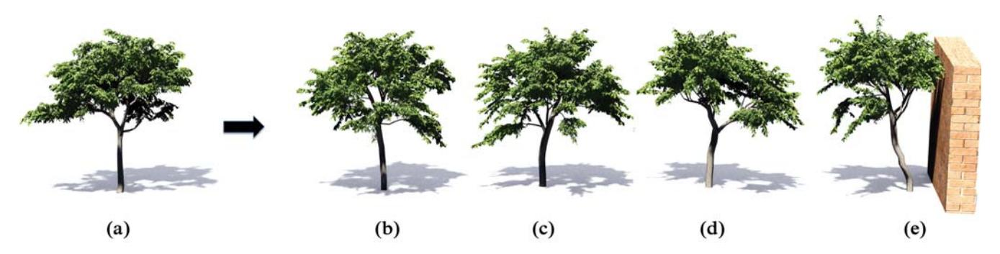

**Figure 1:** *An input polygonal tree model (a) has been processed by our inverse procedural modelling system and the input parameters of the developmental model have been estimated so that it can produce stochastically similar trees (b–d). The developmental model is able to produce environmentally sensitive trees models (e).*

The input is approximated by the resulting procedural model with its set of input parameters. We demonstrate our framework on various tree models and show how their procedural representation can be used to generate more trees of the same species, trees of different ages or trees grown under different environmental conditions.

# **2. Related Work**

Plant modelling has been the focus of computer graphics research for a long time. Traditional methods are rulebased systems [Hon71, PL90], particle systems [RB85], environmental sensitive automata [Gre89] and space colonization methods [PHL\*09, RLP07].

In the last decade some effort has been devoted to the reconstruction of real trees. Reche-Martinez *et al.* [RMMD04] use a set of registered images to generate volumetric representations of the tree canopy, and Neubert *et al.* [NFD07] work on loosely arranged inputs. In contrast to image-based methods, Livny *et al.* [LPC\*11] reconstruct trees from laser-scanned point sets (see also [XGC07]).

Two recent approaches dynamically adjust tree models according to their graph skeleton. The first approach proposed by Pirk *et al.* [PNDN12] infers the early developmental stages from one input exemplar and the second approach of Pirk *et al.* [PSK\*12] employs environmental sensitivity to static input trees and allows the user to automatically change the tree topology under varying environmental conditions. Both methods focus on an efficient processing; the underlying developmental models only utilize a subset of parameters required for a growth model and thus do not allow generation of new tree models or adding branches. Their methods do not allow for inferring all parameters that is required for a developmental model learning.

Sketch-based methods have been used to guide tree modelling [OOI06, CNX\*08] by using biologically motivated rules to infer the 3D structure of a tree from 2D input [LRBP12]. Other interactive methods allow the user to control the modelling process by changing a set of parameters. One of the first user-aided methods is the work of Weber and Penn [WP95], and after it came the Xfrog modelling system [LD99], in which rule-based and procedural modelling are combined to directly affect the model of a plant. An overview of different modelling techniques has been presented by [DL04].

The difficulty of controlling the rewriting process and the low intuitiveness of the rule creation lead to works that focus on the problem of inverse procedural modelling. Ijiri *et al.* [IMIM08] propose a system that constructs a procedural model from an arrangement of 2D elements. Stava *et al.* [SBM10] use transformation spaces to build procedural rules that describe an arbitrary vector image. An extension of this approach to 3D is presented by [BWS10]. In both of these works, convincing procedural models could be obtained only for highly regular and symmetric inputs, but not for stochastic data.

Finding a set of parameters that would generate a given input of a procedural model is a complex task. The parameters can be estimated using optimization techniques such as the MCMC sampling [MRR\*53]. This approach was used for finding the procedural representation of facades [RB06] or for directing the rewriting process in procedural modelling [TLL\*11]. Both methods rely on a known procedural model with predefined parameter values that were used to compute the best model fitting to the input data. Similar to our method is the approach of Vanegas *et al.* [VGDA\*12] that estimates input parameters of a procedural model. However, their approach is aimed at interactive modelling of regular virtual cities in order to provide high-level control and at matching stochastic models. Moreover, Cournede *et al.* [CLM\*11] present a method that automatically detects parameters of stochastic procedural plant models, but it relies on precise measurements of biomass distribution in real trees, which would be infeasible in computer graphics applications.

# **3. Method Overview**

To find the computer graphics procedural representation for different input trees, we need a procedural model powerful enough to generate a variety of trees species. It is difficult to reverse engineer an entire model including its structural description but given an appropriate parametric model many species can be expressed. This reduces our problem to finding the right set of parameters for a given procedural model that is able to generate trees resembling the input.

Our modelling framework (see Figure 2) uses either a single or multiple geometric tree models such as LiDAR scans, Xfrog library

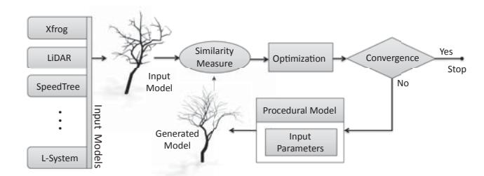

**Figure 2:** *Framework overview: input parameters of the procedural model are estimated via optimization and similarity measures between the input and the generated model.*

models, SpeedTree models or trees generated by Open L-systems. The model is converted into a tree graph representation [GC98] using an algorithm inspired by Au *et al.* [ATC\*08].

We then use our procedural model that incorporates recent findings in plant biology and computer graphics (see Section 4). The input parameters for the model are determined by maximizing a similarity measure that computes the visual and structural resemblance of two trees (Section 5). This is done by MCMC-based optimization that proposes new parameter values that gradually increase the similarity of the generated trees and ends when the parameters can no longer be significantly improved (Section 5.4).

# **4. Used Procedural Model**

Trees have a wide range of shapes corresponding to various tree species that can be represented by a developmental model with high expressive power. Various developmental plant models exist, but they often describe only a limited number of species.

We introduce a new parametric procedural model based on recent advances in plant biology [CH06] and computer graphics [PHL09]. It uses a developmental formulation in which during each growth cycle the tree grows shoots from active buds. The new shoots then grow and create buds that can grow during the next cycle. The growth of individual shoots and flushing of buds is controlled using a lightbased model described in [PSK\*12]. Note that one growth cycle does not necessarily correspond to 1 year because some species undertake multiple growth cycles per year [CH06].

#### **4.1. Parameters**

Our model is controlled by a set of 24 parameters ¯ϕ describing effects of internal and external factors on the tree shape. The parameters belong to three groups: (1) geometric, (2) environmental and (3) parameters determining bud fate. The geometric parameters define shapes of particular plant organs such as internode length or phyllotaxis and they are important for the overall plant shape. The actual branching structure and density is controlled by the bud fate parameters. Lastly, environmental parameters are used to describe interaction of a tree with its environment, for example with light and gravity.

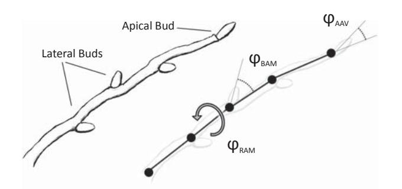

**Figure 3:** *Various parameters affect shoot growth: bending angle* ϕBAM*, roll angle* ϕRAM*, and apical angle variance* ϕAAV *.*

We have presented a moderately large parameter space for which it is difficult to find the appropriate parameters for a target species manually. Inverse modelling, with the help of a capable optimization algorithm with efficient sampling of the parameter space, provides an automatic solution.

**Geometric parameters** represent properties of different tree species on tree geometry. A group of parameters determines the *phyllotaxy* of a tree. They control number and relative orientation of lateral buds along a shoot as shown in Figure 3 and in Table 1. Additional parameters describe the variance of individual angular variables that add randomness into the generated trees. The apical bud is always located at the end of the shoot, and its orientation with respect to the parent shoot is determined by a spherical angle (θ,φ);{θ ∼ N (0, ϕAAV ),φ ∼ U(0, 2π)}, where N and U are the normal and uniform distributions, respectively, and ϕAAV is the *apical angle variance* parameter. Increasing its value adjusts the branching structure as shown in Figure 4(a).

The shoot length is controlled by the *growth rate* (ϕ*GR*) and the *internode base length* (ϕ*IBL*), which together determine the distance between two nodes containing lateral buds. The number of internodes n*IN* generated by a single shoot is computed as rounded growth rate n*IN* = ϕ*GR*, and the length of a shoot is nIN ϕ*IBL*. The values of ϕ*GR* and ϕ*IBL* can change based on the location and tree age. The initial internode length decreases with the increasing tree age [OL96] and is expressed by *internode length age factor* (ϕ*IL AF*), which modifies the actual internode length because ϕ *IBL* = ϕ*IBL*ϕt *IL AF*, where t is the age of the tree. The age factor is usually smaller but close to one, which causes the length of internodes to gradually decrease as the tree gets older.

The growth rate of a shoot ϕ*GR* is primarily affected by the dominance of its parent branch, described by *apical control* (ϕ*AC*) [CBH09]. If its value is high, shoots growing from dominant branches grow faster than shoots growing from lateral ones, resulting in a tall tree with a significant trunk. Trees with a low apical control have a spherical crown as all branches grow with similar speed (see Figure 4b). Apical control directly modifies the growth rate

$$\varphi'_{GR} = \begin{cases} \varphi_{GR}/\varphi_{AC}^{5k} & \text{if } \varphi_{AC} > 1 \\ \varphi_{GR}/\varphi_{AC}^{5k-s_{max}} & \text{otherwise.} \end{cases} \quad (1)$$

**Table 1:** *Summary of all parameters of the growth model.*

| Parameters                  | Name                                             | Description                                                        |
|-----------------------------|--------------------------------------------------|--------------------------------------------------------------------|
| ϕ AAV                       | Apical angle variance                            | Variance of the angular difference between the growth direction    |
|                             |                                                  | and the direction of the apical bud.                               |
| ϕ NLB                       | Number of lateral buds                           | The number of lateral buds that are created per each node of a     |
|                             |                                                  | growing shoot.                                                     |
| ϕ BAM , ϕ BAV               | Branching angle mean and variance                | The mean and variance of the angle between the direction of a      |
|                             |                                                  | lateral bud and its parent shoot.                                  |
| ϕ RAM , ϕ RAV               | Roll angle mean and variance                     | The mean and variance of an angular difference orientation of      |
|                             |                                                  | lateral buds between two internodes.                               |
| ϕ AB D , ϕ LB D             | Apical and lateral bud extinction rate           | The probability that a given bud will die during a single growth   |
| ϕ LF A , ϕ LF L             | Apical and lateral light factor                  | The influence of light on the growth probability of a bud.         |
| ϕ AD BF , ϕ AD DF , ϕ AD AF | Apical dominance base, distance, and age factors | Control over the auxin production and transport within a tree.     |
| ϕ GR                        | Growth rate                                      | The number of internodes generated on a single shoot during        |
|                             |                                                  | one growth cycle.                                                  |
| ϕ IBL , ϕ IL AF             | Internode length and age factor                  | The base length of a single internode and its relation to the tree |
| ϕ AC , ϕ AC AF              | Apical control level and age factor              | The impact of the branch level on the growth rate ϕ GR and its     |
|                             |                                                  | relation to the tree age.                                          |
| ϕ PT , ϕ GT                 | Phototropism and Gravitropism                    | The impact of the average direction of incoming light and          |
|                             |                                                  | gravity on the growth direction of a shoot.                        |
| ϕ PF                        | Pruning factor                                   | The impact of the amount of incoming light on the shedding of      |
| ϕ LB PF                     | Low branch pruning factor                        | The height below which all lateral branches are pruned.            |
| ϕ GBS , ϕ GBA               | Gravity-bending strength and angle factor        | The impact of gravity on branch structural bending and its         |
|                             |                                                  | relation to branch thickness.                                      |
| t                           | Growth time                                      | Controls the age and size of the generated trees.                  |

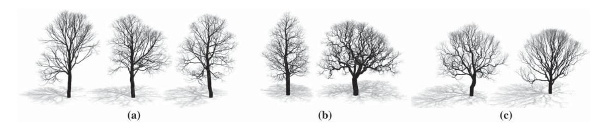

**Figure 4:** *(a) The effect of increasing branching angle (from left to right); (b) a tree with high apical control (left) has a long trunk and shorter side branches, whereas low apical control causes trees to have the typical spherical crown (right); (c) high apical dominance results in less-frequent branching enabling certain branches to become dominant (left). A tree with low apical dominance tends to branch very often, creating many equally dominant branches (right).*

ζk is the level of the parent branch [BAS09]. More dominant branches have lower levels. The value of apical control usually decreases with increasing tree age, which allows the tree to form a denser crown at the later stages of its growth [OL96]. We control this time dependence with *apical control age factor* (ϕ*AC AF*), which modifies the original apical control as ϕ *AC* = ϕ*AC*ϕt *AC AF*.

The parameters from the previous part define the geometric properties of individual branch segments, but the internal tree structure is primarily defined by the fate of its buds that is controlled by bud fate parameters. A single shoot usually contains many buds, but not all of them flush and grow during the growth cycle. Some may stay dormant until the conditions are favourable, or they might die as a result of biological or environmental factors. During each growth cycle, we set the parameters ϕ*AB D* and ϕ*LB D*, which specify the probability that a given apical (ϕ*AB D*) or lateral (ϕ*LB D*) bud died before the growth cycle started. Living buds can either form a new shoot or remain dormant as a function on illumination and the plant hormones [Sri02]. We represent the influence of light on apical buds with the *apical light factor* ϕ*LF A* and on lateral buds with the *lateral light factor* ϕ*LF L*.

The fate of a bud depends on the hormone auxin, which is produced and transported towards the root when a bud starts growing into a new shoot. A high level of auxin inhibits lateral buds from flushing, effectively delaying the growth of side branches [CBH09]. This allows a tree to form more significant branches that hold smaller lateral branches. If the level of auxin is low, the tree branches more frequently, thus creating a regular structure with high density and without dominant branches (see Figure 4c). In real trees auxin also controls the growth rate that is considered constant in our model.

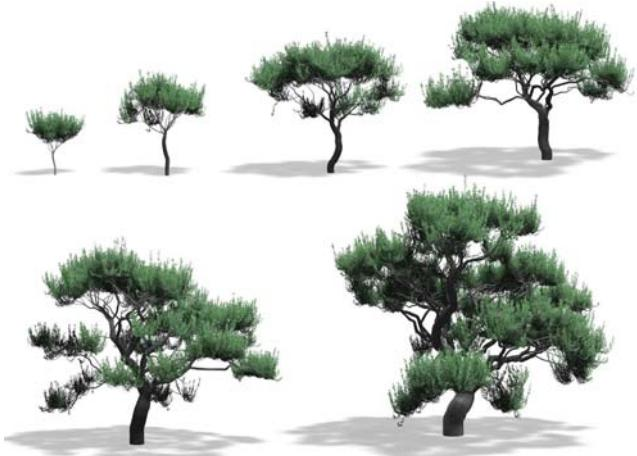

We encode such *apical dominance* in three parameters: ϕ*AD BF* is the *apical dominance base factor* corresponding to the amount of auxin produced by a flushing bud. The concentration of auxin decreases as it is transported towards the roots, described by *apical dominance distance factor* ϕ*AD DF*. Apical dominance often decreases with increasing tree age, represented as *apical dominance age factor* ϕ*AD AF*.

Apical dominance should not be confused with the apical control. Even though they are often used interchangeably, their cause and their effect are different [CH06]. Apical control influences the growth rate of a shoot, but apical dominance controls bud flushing. Apical control is used together with the light factors to compute the probability P(F(**b**i)) that a given bud **b**i will flush. For apical buds the probability is

$$P(F(\mathbf{b}_i)) = I(\mathbf{b}_i)^{\varphi LF-A}, \quad (2)$$

where *I*(**b**i) is the illumination of the bud. It is computed using the light model [PSK\*12].

Lateral buds grow new shoots with probability

$$P(F(\mathbf{b}_i)) = I(\mathbf{b}_i)^{\phi_{LF} - L} \exp \left( - \sum_{\mathbf{b}_j \in \Lambda(\mathbf{b}_i)} \delta_j \varphi_{AD_{BF}} \varphi_{AD_{AF}}^t \varphi_{AD_{DF}}^{d(\mathbf{b}_i, \mathbf{b}_j)} \right), \quad (3)$$

where (**b**i) is a set of all buds located above the given lateral bud, and δj = 1 if the bud **b**j flushed and otherwise zero. The value of d(**b**i, **b**j ) is the branch-wise distance (Section 5.2) between buds **b**i and **b**j .

**Environmental parameters** define how the surrounding environment affects the plant. Light and gravity directly influence the growth direction of a shoot. In normal conditions, shoots grow in the direction defined by their source bud, but the growing shoot can bend towards or away from an impetus that is described by *tropisms*. *Phototropism* (ϕ*PT* ) is bending towards light, and *gravitropism* (ϕ*GT* ) is bending away from the gravity. The bending is simulated using the approach from Palubicki *et al.* [PHL\*09], where the parameters ϕ*PT* and ϕ*GT* represent the strength of bending.

An increasing pruning factor ϕ*PF* causes more intense shedding of shadowed branches. Many branches are also removed due to human or animal intervention, etc. We simplify these influences by using a single parameter called *low-branch pruning factor* (ϕ*LB PF*). It specifies the maximal height up to which all side branches are pruned.

As a tree grows older, the branches bend down in a response to increasing weight of their child branches. The sagging of older branches is especially important for many coniferous and other

**Figure 5:** *Growth of a tree generated with our developmental model at ages (left to right): 5, 10, 15, 20, 25 and 30 years.*

softwood species (Figure A1). We propose a simplified model that simulates the bending at each node of the grown tree by using the orientation of the bent branch and the total mass of its child branches (see Appendix A).

# **4.2. Foliage**

Instead of directly simulating the growth of foliage we use a procedural system from Livny *et al.* [LPC\*11]. The leaves are located along the terminal branches. A certain species is assigned manually to a model and additional branchlets are generated that hold the leaves. This results in a higher foliage density, which is favourable for scanned models of real trees because they usually contain only the main branches. We used a set of leaf templates for many deciduous and coniferous trees, including willow, mahogany, pine and thuja species. The leaves are generated at the end of the growth cycle.

# **4.3. Example trees**

Figure 5 shows the development of a tree achieved by our procedural model. The individual images were captured with a time difference of 5 years. Figure 6 shows several examples that were generated using our approach by directly setting the parameters (see Table 2). The variety of shapes has been achieved by changing the parameter values, and each tree was generated using a trial-and-error approach because the parameter space is large, and expressing the designer intention in this way is difficult.

# **5. Similarity Measure and Optimization**

Having described our parametric model, we now want to focus on how to find a set of parameters that maximizes the similarity measure between the input data and the generated trees. Although possible, we make no attempt to optimize the environmental parameters of the

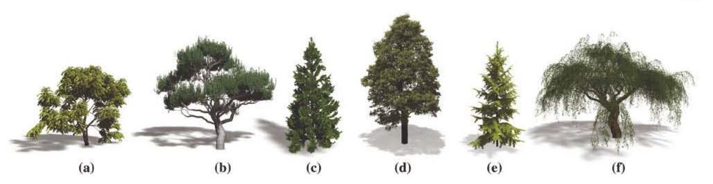

Figure 6: *Different species generated with the procedural model. The corresponding prameter values can be found in Table 2.* 

Table 2: *Parameters for trees generated by the deve/opmefltal model (see Table* 1).

| Param    | F6a  | F6b   | F6c   | F6d   | F6e   | F6f  |
|----------|------|-------|-------|-------|-------|------|
| 'PAAV    | 38   | 0     | 10    | 5     | 2     | 12   |
| 'PNLB    | 4    | 2     | 2     | I     | 60    | 2    |
| 'PBAM    | 38   | 41    | 51    | 45    | 3     | 43   |
| 'PB.~V   | 2    | 3     | 4     | 5     | 130   | 3    |
| 'PRAM    | 91   | 87    | 100   | 130   | 10    | 80   |
| 'PRAV    | 1    | 2     | 30    | 3     | 0     | 4    |
| 'PAB..D  | 0    | 0     | 0     | 0     | 0.018 | 0    |
| 'PLB.D   | 0.21 | 0.21  | O.ot5 | 0.01  | 0.03  | 0.21 |
| 'PLF..A  | 0.39 | 0.37  | 0.36  | 0.5   | 0.21  | 0.36 |
| 'PLF.L   | 1.13 | 1.05  | 0.65  | 0.03  | 0.5   | 1.05 |
| 'PAD..BF | 3.13 | 0.37  | 6.29  | 5.59  | 0.55  | 0.38 |
| 'PAD..DF | 0.13 | 0.31  | 0.9   | 0.5   | 0.91  | 0.31 |
| 'PAD..AF | 0.82 | 0.9   | 0.87  | 0.919 | 2.4   | 0.9  |
| 'PGR     | 0.98 | 1.9   | 3.26  | 4.25  | 0.4   | 1.9  |
| 'PIBL    | 1.02 | 0.49  | 0.4   | 0.55  | 0.97  | 0.51 |
| 'PILAF   | 0.91 | 0.98  | 0.96  | 0.95  | 5.5   | 0.98 |
| 'PAC     | 2.4  | 0.27  | 6.2   | 5.5   | 0.92  | 0.25 |
| 'PAC..AF | 0.85 | 0.90  | 0.9   | 0.91  | 0.05  | 0.70 |
| 'PPT     | 0.29 | 0.15  | 0.42  | 0.05  | 0.15  | 0.15 |
| 'PGT     | 0.61 | 0.17  | 0.43  | -0.01 | 0.22  | 0.13 |
| 'PPF     | 0.05 | 0.82  | 0.12  | 0.48  | 1.11  | 0.80 |
| 'PLB..PF | 1.3  | 2.83  | 1.25  | 5.5   | 0.32  | 2.90 |
| 'PGBS    | 0.73 | 0.195 | 0.94  | 0.09  | 0.12  | 0.19 |
| 'PGBA    | 0.05 | 0.14  | 0.52  | 0.89  | 0.78  | 0.14 |
|          | 8    | 26    | 14    | 28    | 10    | 30   |

procedural model that are used for the synthesis of trees interacting with the envirorunent.

Various similarity measures have been used in computer graphics and in biology. Some of them concentrate on the branching skeleton [FGOO] whereas others focus on the foliage rendering [NPDDll]. In contrast, we introduce a new similarity distance that incorporates shape, geometry and structure and evaluates the visual and structural differences between two botanical tree models r 1 and r2 • Our similarity distance is composed of three different components that measure the differences between the two trees at three different quantitative levels: (1) the shape distance ds(r1, r2)

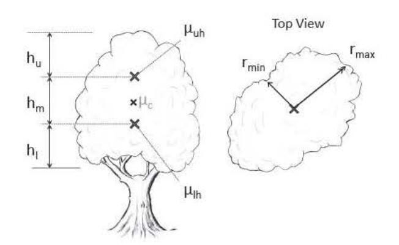

Figure 7: *The tree crown is divided into three parts that are then compared independently between two trees.* 

measures the difference between the overall shapes of the trees; (2) the geometric distance dG(r1, r2 ) compares the global geometric branching properties and (3) the structure-based distance d7 (r1, r2) detects local differences between individual branches based on their position within the trees.

Pirk *eta/.* [PNDN12] proposed a geometric approach for estimation of tree parameters from polygonal models. Although estimating some values directly from the model could speed up the optimization, we observed that the optimization time is not a bottleneck and decided to use full optimization of all parameters from the scratch. Moreover, our optimization works with any input model and is not limited to models compatible with approaches presented by [PNDN12].

# 5.1. Shape distance

Tite shape distance function evaluates several descriptors that define the shape, as illustrated in Figure 7. The height of the tree r is described by J...s,h{ r). Tbe crown shape is affected by the distribution of leaf branches along the vertical axis of the tree. To capture the variances in this distribution, we divide the tree into three horizontal slabs as shown in Figure 7.

To find the separating planes, we first compute the geometric mean of tbe crown *f.Lc* that divides the entire crown into two halves. The location of the separating planes is then defined by the geometric means f.louh and J.loth of the upper and lower halves, respectively.

For each slab, we compute a set of shape descriptors {A.s,c} that capture their height *h*1, the average radius in the horizontal principal directions of the crown rmin and r1ru11 , and their leaf-branch density, where the leaf-branches are all tenninal branches. Having two trees 1:1 and 1:2 , we first compute the differenceso,5 between all descriptors As

$$\delta_{\lambda_{S,i}} = 1 - \exp\left(-\frac{(\lambda_{S,i}(\tau_1) - \lambda_{S,i}(\tau_2))^2}{2\sigma_{\lambda_{S,i}}^2}\right), \quad (4)$$

where *<'>.s,;* is a normalization factor that ensures comparability of different descriptors. Based on our experiments we set the normalization factor to <J>.s,; = *-k* min (>..s,t(<1), As,t(<z)), which resulted in a fast convergence during the optimization process.

The shape distance is then computed as the Minkowski distance of order p of the vector gs to the origin. If p = I, the distance is essentially just an averaged sum of the differences, and with increasing p, the weight of larger differences increases. From our experiments we set *p* = 2.5, which gives a noticeably higher importance to large differences without significantly degrading the impact of the lower ones.

#### 5.2. Geometric distance

The shape of two trees can be similar even if there are noticeable differences in the geometric properties of their branching structures. The geometric properties of a tree are defined by the statistics of the geometry of its branches and by their relative orientation.

#### 5.2.1. *Branch geometry*

Properties of branch geometry are computed from the tree graph. Each branch is described by a set of properties {bt} (see Table 3) that are computed from the geometric information of the branches, as illustrated in Figure 8.

1able 3: *Geometric properties of a single node in the branch graph.* 

| Sym. | Name          |                                                                            |           |
|------|---------------|----------------------------------------------------------------------------|-----------|
| bL   | Length        | Total length of the branch.                                                |           |
|      |               | Description                                                                | Fonnula   |
|      |               |                                                                            | L:=I dt   |
| bo   | Thickness     | Maximal thickness of the branch.                                           | maxvd; tt |
| ba   | Defonnation   | Accumulated angular deflection.                                            | L: :al    |
| br   | Straightness  | Ratio between the end-point distance and the real length of the branch.    | ~ bL      |
| bs   | Slope         | Angle between the direction of branch end points and the horizontal plane. | Ldse      |
| bAs  | Sibling angle | Angle between the branch and its nearest sibling.                          | fts       |
| bAP  | Parent angle  | Angle between the branch and its parent branch.                            | ws        |

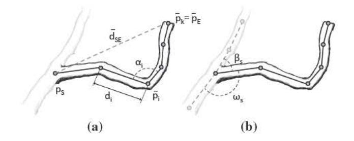

Figm·e 8 : *Geometric properties of a single graph node.* 

We obtain geometl"ic descl"i pto1·s from the geometric properties described in Table 3. All geometric properties, except the branch length and thickness, are calculated by using sample points over the tree. The descriptors are defined as the weighted mean and variance of these samples.

The sample weight of the geometric attributes is computed using the length and the thickness of the given branch and reflects the different impacts of smaller and larger branches on the similarity between the two trees. For angular properties (sibling and parent angles), the weights are computed directly from the branch thickness as either w~ = *b 0* or w~ = *b1.* The remaining branch properties are weighted with w~ = *bvbL* and *wZ* = *b1bL·* The weighting scheme *w"* denotes the dominant variation that puts more focus on the main branches, while the weights *w'* capture characteristics of smaller branches that form the foliage. By using two different weights for each branch property, we compute two different sample means and variances for every geometric attribute.

The sample means and sample variances are then used as geometric descriptors AG that are used to compute the geometric distance *dG* using the Minkowski length, as shown in Equation 4.

# 5.3. Structu1·al djstance

The third form of metrics evaluates the difference between individual branches with respect to their position within the tree. Ferraro and Godin [FGOO] evaluate distance between two tree graphs as a minimal cost of transforming all nodes of one tree graph into nodes of the other (the so-called edit distance). The nodes could

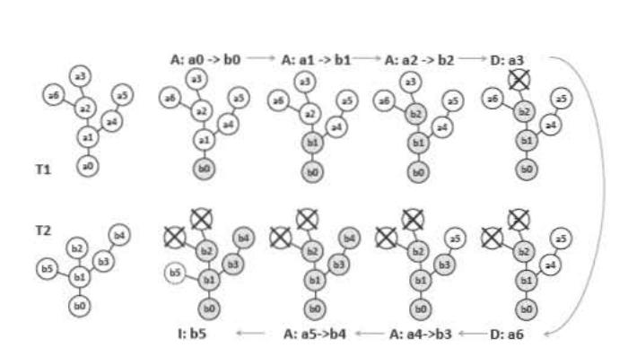

Figure 9: *Edit distance: a sequence of assign, delete, and ii!Sert operations that transform tree* •• *into tree* l"z.

be t111nsformed by X: *assign, insert and delete* ope111tors with a cost *y* defined by the geometric properties of the transfonned nodes. Operator *assign* maps one node from the source tree to a single node of the target tree while operators *ii!Sert* and *delete* create or erase a node from the target tree, respectively. The distance between the two trees r is given by a sequence of operators *s*  that transfonn one tree into the other one at the minimal cost: r = minvs *Lx,cS Y(Xi)* (see an example in Figure 9). This method works correctly when the distribution of nodes is uniform but it quickly loses its accu111Cy when the geometric resolution between the two tree graphs differs, i.e. when one model is modelled in much coarser resolution than the other.

#### 5.3.1. *Split and merge operators*

To address the problem of different geometric resolutions in structural tree distances [FGOO]. we propose new ope111tors that compare tree g111phs with inconsistent and irregular topologies. We define two new ope111tors *split* and *merge* that replace the ope111tors *ii!Sert*  and *delete:* 

- *Split: Xs(t,, tz, tz,l)* divides one node t 1from the first tree r 1into two nodes that are assigned to two nodes of the second tree: *tz* and its ith child node *tz,*1• All subtrees *T,*2\_ 1with roots in all remaining child nodes *t2, 1,* {j ::f. i} are then inserted into the first tree.
- *Merge: XM(t,, t1,1, tz)* is the inverse operator of the split ope111tor. It merges a node t1 from the first tree with one of its child nodes *t1,1·* The merged nodes are then assigned to a single node *t2* from the second tree. All remaining subtrees Tr,,, rooted in child nodes *t* 1, 1, {j ::f. i} are deleted.

An example of the application of ope111tors on a tree g111ph is in Figure I 0. Because both ope111tors can be applied repeatedly, they effectively connect chains of subsequent nodes.

# 5.3.2. *Operator cost functions*

From a structural point of view. the new operators provide no new benefits because the sante output can be achieved by a sequence of insert, delete, and assign operations. However, each use of a split or merge operator effectively changes the geometric properties of

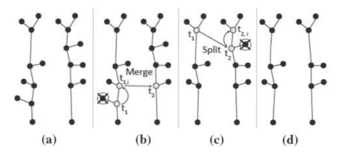

Figm·e 10: *To map the left input tree to the right one (a), we first apply the merge operator to fuse two nodes of the left tree and map them onto a single node of the right tree* (b). *We then split one node of the left tree to map tile result to two nodes of the right tree (c). To compute the cost of the split operation., we apply the node joint* :J *to the two nodes of the right tree and the resulting node is compared to the original node of the left tree (d).* 

the transformed nodes. By changing the geometric properties, we modify the cost of the implicit assign, insert and delete operations that are performed during each split and merge step. The cost of the split *(ys)* and merge *(YM)* operators is

$$\gamma_S(t_1, t_2, t_{2,l}) = \gamma_A(t_1, \mathcal{J}(t_2, t_{2,l})) + \sum_{\substack{v_{l_2,l} \neq j \neq i}} \sum_{v_{l_k \in T_{l_2,l}}} \gamma_I(t_k) \quad (5)$$

$$\gamma_M(t_1, t_{1,i}, t_2) = \gamma_A(\mathcal{J}(t_1, t_{1,i}), t_2) + \sum_{\forall t_{1,j}, j \neq i} \sum_{\forall t_k \in T_{t_{1,j}}} \gamma_D(t_k), \quad (6)$$

where *YA• Yr* and *YD* are the assigning, inserting, and deleting costs. The ope111tor :1 *(ta, tb)* is a so-called *node join* operator that fuses two nodes *ta* and *tb* and creates a new node *ta ..... b* with combined geometric properties of the original nodes (see Appendix B).

# 5.3.3. *Edit dista11ce*

The distance between two tree graphs *Tt* and *Tz* is equal to the minimal cost of t111nsfonning one tree graph into the other. The cost of such a sequence can be computed by a recursive algorithm [Zha96] that evaluates the so-called edit distance *dN(t*1, *t*2) where t 1is the root of *T1* and *t2* is the root of *T2 •* Computing the edit distance between unordered trees is generally an NP-complete problem, but it can be solved in polynomial time when proper constraints are defined [Zha96] (see Appendix B for a discussion of the constraints used in our implementation).

To compute *dN(t,, t2),* we modified the algorithm. When either *t1*  or *t2* is an empty node, we compute the edit distance using the original approach, but the edit distance between two nonempty nodes t 1 and *t2* is now defined using the new ope111tions split and merge

$$d_N = \min \left( \gamma_A(t_1, t_2) + d_F(t_1, t_2), \right. \\ \left. d_F(\varepsilon, t_2) - \max_{\gamma_{2,i}} \left( d_N(t_1, \mathcal{J}(t_2, t_{2,i})) - d_N(\varepsilon, t_{2,i}) \right), \right. \\ \left. d_F(t_1, \varepsilon) - \max_{\gamma_{1,i}} \left( d_N(\mathcal{J}(t_1, t_{1,i}), t_2) - d_N(t_{1,i}, \varepsilon) \right) \right),$$

where *d*F (t1,t2) is the distance between two forests that are created from subtrees of nodes t1 and t2 after the nodes have been removed. We compute *d*F (t1,t2) by solving the mincost max-flow problem on a bipartite graph as described by Zhang [Zha96].

The structure-based distance dT (τ1,τ2) between trees τ1 and τ2 (and corresponding tree graphs T1,T2 with roots t1,t2) is

$$d_T(\tau_1, \tau_2) = \frac{d_N(t_1, t_2)}{2 \max(d_N(t_1, \varepsilon), d_N(\varepsilon, t_2))}. \quad (7)$$

The final similarity measure DT (τ1,τ2) is the sum of shape-based, geometry-based and structure-based distances with corresponding weights wS ,wG,wT ∈ [0..1],wS + wG + wT = 1. A value DT = 0 reflects the exact similarity and 1 no similarity at all. All our results were generated for equal weights. Better results can be achieved if the weights are selected by the user for a specific problem. For example, if she is interested in the similarity of the tree crowns, the shape-based weight wS can be increased while the remaining two weights are decreased.

# **5.4. Optimization of parameters**

A procedural model M is essentially a stochastic system, and each tree τ generated by the model is a realization of this system that is controlled by the parameters ¯ϕ and the time t: τM(ω) ∼ M(¯ϕ,t), where ω{ω ∈ M} is the state variable of M defined in the state space M. In general, there can be infinite number of trees that can be generated by the system M, where the probability that a given tree is generated is determined by some density function p(ω).

To find the model parameters that maximize the resemblance of the generated model to the input tree, we maximize the similarity measure by minimizing the distance function DT (τ1,τ2). The optimization problem is then defined as

$$\text{argmin}_{\bar{\varphi}_{M,t}} \left( \int_{\omega} D_T \left( \tau^r, \tau^{\mathcal{M}}(\omega) \right) p(\omega) d\Omega^{(M,\bar{\varphi}_{M,t})} \right), \quad (8)$$

where τ r is the reference input tree. The above formulation searches the optimal parameter values ¯ϕ and the optimal growth time t that minimizes the distance for all trees that can be generated by the parametric model M. To compute the distance of all trees, we need to integrate over all possible states ω that are allowed by the model M with parameters ¯ϕ and time t.

The integral of the distance function over all possible generated trees cannot be solved analytically, but its solution can be approximated by the Monte Carlo numerical integration technique. The approximated solution is then computed by randomly sampling the state space M, where each sample represents a single generated tree τM. Since the random samples follow the probability density function p(ω), the approximated optimization problem can be written as

$$\bar{\varphi}_{\mathcal{M}}, \text{targmin} \left( \sum_{\omega_j} D_T \left( \tau^r, \tau^{\mathcal{M}}(\omega_j) \right) \right), \quad (9)$$

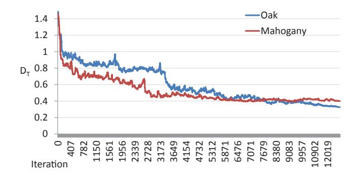

**Figure 11:** *Optimization of the tree distance.*

where ωj are the random samples following the density p(ω) that is specific for every model M(¯ϕ,t). The number of samples ωj determines the accuracy of the approximated solution, as discussed in Section 6.

Because the relation between the model parameters ¯ϕ and the distance DT is unknown, we have to solve the optimization problem from Equation (9) indirectly using one of the stochastic or heuristics optimization methods. In our work we use the Simulated Annealing algorithm that is based on stochastic sampling of the parameter space using the Metropolis-Hastings sampling strategy [MRR\*53]. The probability that a given parameter sample x¯i ={ϕ¯i,ti} is going to be accepted is then

$$\alpha = \left( \frac{p(\bar{x}_i)}{p(\bar{x}_{i-1})} \right)^{\frac{1}{\xi_i}}, \quad (10)$$

where x¯i−1 is the previous parameter sample and, according to Equation (9):

$$p(\bar{x}) = \exp \left( - \sum_{\omega_j} D_T \left( \tau^r, \tau^{\mathcal{M}}(\omega_j) \right) \right). \quad (11)$$

The value of ζi is the temperature specific for a given iteration i. The Simulated Annealing algorithm starts with ζ0 set to a maximum temperature ζmax and the temperature is then linearly decreased until it reaches 0 for the last iteration ilast . For all our examples we used values ζmax = 4 and ilast = 7500. The convergence of our method for two results is shown in Figure 11.

#### **6. Results**

Here, we show the results of our method on input models from various sources. The time required to process the input models is summarized in Table 4. The optimization was performed by gen-

**Table 4:** *Processing time for different tree models.*

|                      | <b>Figure</b> | <b>1</b>   | <b>12</b>  | <b>13(a)</b> | <b>13(b)</b> | <b>14</b>  | <b>15 (left)</b> |
|----------------------|---------------|------------|------------|--------------|--------------|------------|------------------|
|                      |               |            |            |              |              |            |                  |
| <b><i>t</i>(min)</b> | <b>85</b>     | <b>43</b>  | <b>53</b>  | <b>12</b>    | <b>270</b>   | <b>45</b>  |                  |
| <b>Nodes</b>         | <b>587</b>    | <b>359</b> | <b>464</b> | <b>298</b>   | <b>2307</b>  | <b>521</b> |                  |

erating eight sample trees for each input model (see Equation (9)) that provided enough variation to sufficiently capture the shape of the input trees.

#### **6.1. Input models**

# **6.1.1.** *Plant libraries*

Plant libraries created by using interactive systems belong among the most common sources of tree models. To capture this resource we applied our method on trees that were obtained from the Xfrog library [DL04]. Because of the nature of direct modelling techniques, the trees often contain repetitive regular small branches that cannot be represented exactly by a stochastic model. Although the structure of the smaller branches might not be recreated properly, it was possible to faithfully model the overall appearance of these inputs, as shown in Figure 12.

# **6.1.2.** *Scanned tree data*

An important class of models consists of polygonal models of real trees that were reconstructed from scanned data [LYO10, LPC11]. They represent mostly young trees with relatively sparse branching structures; otherwise they could not have been effectively scanned. The input data typically contain only a few most significant branches because the smaller ones were difficult to retrieve. Although the missing data poses a problem to inverse procedural modelling, we were able to capture the shapes and structures of many of the analysed models, as seen in Figures 1 and 13.

# **6.1.3.** *Developmental models*

Tree models can be also created using developmental rule-based systems that are also used in biology. We have tested an Open Lsystem approach by Mech and Prusinkiewicz [MP96]. Although the ˇ Open L-system description is developmental and uses internally a set of rules with input parameters, our system was able to find a set of parameters that generates models with high similarity using our developmental model, as shown in Figure 14.

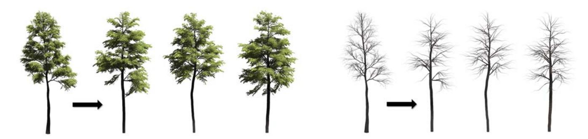

# **6.1.4.** *Environmental interaction*

An important property of our framework is that the trees are represented as a growth model with a set of parameters. This allows the tree to develop while interacting with the surrounding environment, as shown in Figure 15. When trees are reconstructed while standing in close proximity, the competition for light prunes the colliding branches as shown on the middle tree. If a tree grows close to an obstacle, any shadow cast by the obstacle will cause significant shape alterations. This adds an important developmental property to otherwise static input models.

# **6.2. Limitations**

Our technique has been successfully applied to obtain a procedural representation of many input geometric trees. Nevertheless, our method can be thought of as an example-based approach, and it fails to produce good results when the input data does not provide sufficient information, such as missing branches or incorrect topology. These problems could be resolved, at least partially, if the distance functions are modified to provide explicit information according to the specific characteristics of such input data.

The analysis of trees from model libraries revealed other issues. The inverse method was unable to accurately capture the regular nature of some input trees. To solve this problem, it would be necessary to add a support for these branching patterns into the developmental model. However, such regularity can make the reusability of resulting procedural models problematic.

Since our procedural model is stochastic it can generate a wide variety of trees for a given set of parameters. However, it cannot reproduce the input model exactly. Furthermore, the inverse procedural approach is tied to our model. Our set of parameters allows generation of a large amount of output trees. However, there may be a tree species that is not captured by our procedural model. If such a case arises, it would be necessary to extend the procedural model accordingly.

**Figure 12:** *A model from the Xfrog library. Left: The input model and three reconstructions. Right: The skeletal structure of the same models.*

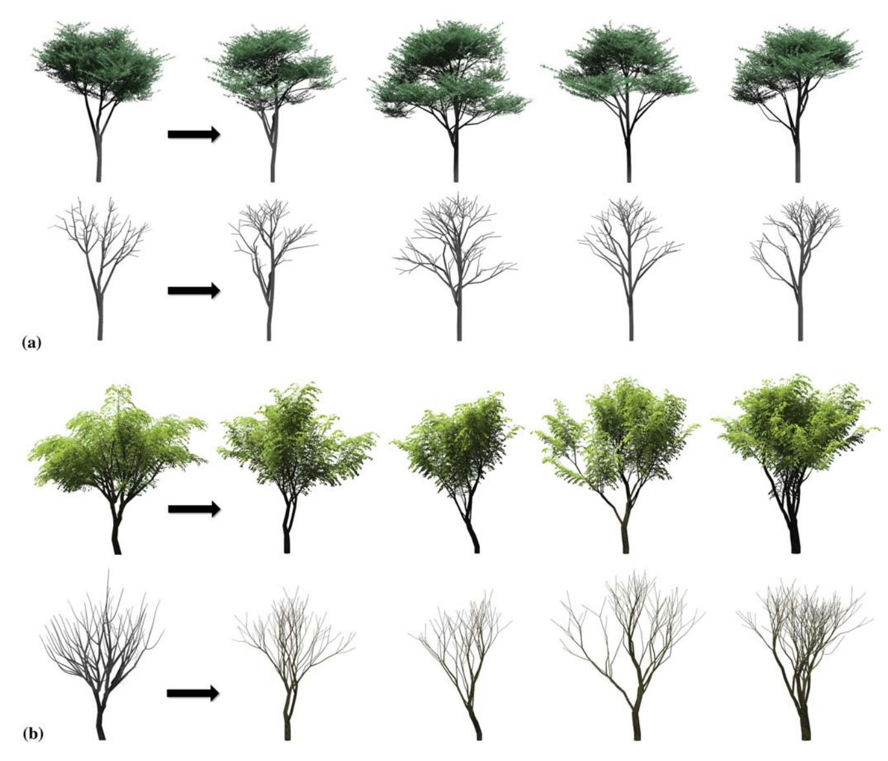

**Figure 13:** *Two models obtained from scanned data. Mahogany (a) and Ficus Virens (b).*

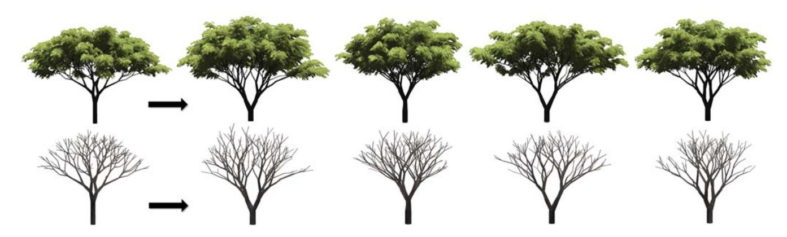

**Figure 14:** *A model generated using Open L-systems (left) has been reconstructed using our inverse approach (right).*

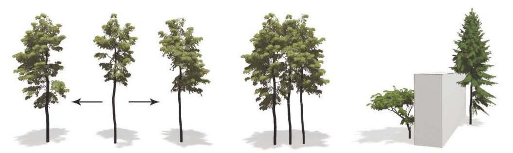

Figm·e 15: *Environmental interaction: Left: An input model was reconstructed, and its three instances are grown together. Middle: Competition for light prunes the branches that collide, resulting in a significantly different geometry that was not captured by the input; Right: Two reconstructed trees automatically adapt their shapes to obstacles.* 

# 7. Conclusion and F utm-e Work

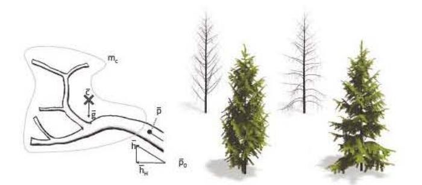

We have introduced an approach to inverse procedural modelling of trees. Our approach uses an ad hoc developmental model that captures a wide variety of tree species. Our inverse procedural framework automatically detects the parameters that generate a tree by maximizing similarities between the input trees and generated tree. We have shown that our approach can be used to obtain the procedural representation of various tree species using inputs ranging from developmental models using L-systems, to scanned and reconstructed data, and even to hand-modelled trees from plant libraries.

Because the underlying procedural model is stochastic, for a given set of parameters it generates a set of similar trees. Because of this property, the inverse system cannot precisely reproduce the sante structure of the input tree. To achieve this, we would need to control the stochastic growth of the procedural model so that *all* random parameters generated during application of the rules were replaced by fixed values. This is essentially another optimization problem, and it was addressed in a similar context by Talton *eta/.* [TLLI 1 ].

## Ackn owledgements

This work bas been supported by the NSF ITS 0964302, Adobe Inc., NVIDIA research gifts and the DFG Research Training Group GK-1 042 'Explorative Analysis and Visualization of Large Information Spaces', University of Konstanz, Germany.

# Appendix A: Computing tlte Bending of a Branch

To compute the bending of a branch (see Figure AI) at node *p0*  with an orientation ii, we first compute the bending force *fb* on node *Po* as

where *Po* is the location of the node *p0 , me* is tlte mass of supported branches with its centre at pointe, vector iiH is the horizontal portion of the normalized branch direction *h,* and *g* is the direction of gravity.

Figure Al: *Heavy branches can bend down because of the weight.* 

Lastly, *ifJGBS* denotes the *gravity-bending strength.* The actual effect of the bending force on the orientation of the branch depends on tlte thickness at the given node *Po* and on the accumulated bending angle fJ<1- 1l(p0) that the branch bas already been subjected to until *timet.* 

The thickness *d(p0 )* is used to compute the maximal bending angle of a single branch as

$$\beta_{\max}(p_0) = \frac{\pi}{2} \varphi G B A^{d(p_0)},$$

where ~pGBA is a parameter called *gravity bending angle factor.* 

The new bending angle fJ(p0) applied to the branch is

$$\beta(p_0) = \max \left( 0, \beta_{\max} \exp \left( -\frac{|f_b|}{\beta_{\max}} \right) - \beta^{(t-1)} \right),$$

and the new accumulated bending angle fJ(Il(p0) is then

$$f_b = \varphi_{GBS} m_c \left| (\bar{c} - \bar{p}_0) \bar{h}_H \right| (1 - |\bar{h}\bar{g}|).$$

$$\beta^{(t)}(p_0) = \beta^{(t-1)}(b_k) + \beta(p_0).$$

With the increasing accwnulated bending, subsequent bending becomes more difficult. Also, as the tree grows older, the bending is hampered by the increasing thickness of the older branches.

# **Appendix B: Operator Cost Function Details**

To compute the structural distance in polynomial time, the cost of individual operators needs to be properly constrained [Zha96]. In our implementation the cost of joining two nodes J (ta ,tb) has to be defined so that γD(J (ta ,tb)) ≥ γD(ta ) + γD(tb), and γI (J (ta ,tb)) ≥ γI (ta ) + γI (tb). In other words, deleting or inserting a combined node should not cost less than the total cost of deleting or inserting its original components. We compute the geometric properties of J (ta ,tb) by applying the formulas from the last column of Table 3 on the fused tree graphs. Geometric properties such as length, thickness and slope of the branches are used to weight the costs of γA(tk ), γI (tk ) and γD(tk ). The cost of deletion or insertion of node tk is computed from the total length bL(tk ) and thickness bT (tk ) of branches that are contained within the node as χI (tk ) = χD(tk ) = bL(tk )bD(tk ). To compute the cost of assigning node t1 to node t2, we first define an ordered pair of nodes (t min,t max) where (t min,t max) = (t1,t2) if the total length of branches in node t1 is smaller than in node t2; otherwise (t min,t max) = (t2,t1). The assign cost is then χA(t1,t2) = *s*(t1,t2)bL(t min) (bD(t1) + bD(t2)) + bL(t max) − bL(t min) bD(t max), (B.1) where *s*(t1,t2) is the dissimilarity factor between branches contained within nodes t1 and t2. The dissimilarity factor is the normalized Minkowski distance of a set of local differences δB that compare slope (bS ), straightness (bT ) and deformation (bα) of the branches represented by nodes t1 and t2. The differences are computed using Equation (4). The dissimilarity factor is then *s*(t1,t2) = p 1 k k 1 p B,i, where k is the number of used local differences and p = 2.5 is the order of Minkowski distance. With increasing dissimilarity or with increasing difference in the lengths bL of the compared nodes, the value of γA(t1,t2) converges to the combined cost γD(t1) + γI (t2). **References** [ATC\*08] AU O. K. C., TAI C. L., CHU H. K., COHEN OR D., LEE T. Y.: Skeleton extraction by mesh contraction. *ACM Transactions on Graphics 27*, 3 (2008), 44:1–44:10. [BAS09] BENES B., ANDRYSCO N., STAVA O.: Interactive modeling of virtual ecosystems. In *Proceedings of NPH* (Munich, Germany, 2009), E. Galin and J. Schneider (Eds.), Eurographics Association, pp. 9–16. [BWS10] BOKELOH M., WAND M., SEIDEL H. P.: A connection between partial symmetry and inverse procedural modeling. *ACM Transactions on Graphics 29*, 4 (July 2010), 104:1– 104:10. [CBH09] CLINE M. G., BHAVE N., HARRINGTON C. A.: The possible roles of nutrient deprivation and auxin repression in apical control. *Trees 23* (Dec. 2009), 498–500. [CH06] CLINE M. G., HARRINGTON C. A.: Apical dominance and apical control in multiple flushing of temperate woody species. *Canadian Journal of Forest Research 37*, 1 (Jan. 2006), 74–83. [CLM\*11] COURNEDE ` P.-H., LETORT V., MATHIEU A., KANG M. Z., LEMAIRE S., TREVEZAS S., HOULLIER F., DE REFFYE P.: Some parameter estimation issues in functional-structural plant modelling. *Mathematical Modelling of Natural Phenomena 6*, 2 (2011), 133–159. [CNX\*08] CHEN X., NEUBERT B., XU Y.-Q., DEUSSEN O., KANG S. B.: Sketch-based tree modeling using markov random field. *ACM Transactions on Graphics 27*, 5 (Dec. 2008), 109:1–109:9. [DL04] DEUSSEN O., LINTERMANN B.: *Digital Design of Nature: Computer Generated Plants and Organics*. Springer Verlag, Heidelberg, Germany, 2004. [FG00] FERRARO P., GODIN C.: A distance measure between plant architectures. *Annals of Forest Science 57*, 5/6 (2000), 445–461. [GC98] GODIN C., CARAGLIO Y.: A multiscale model of plant topological structures. *Journal of Theoretical Biology 191*, 1 (Mar. 1998), 1–46. [Gre89] GREENE N.: Voxel space automata: Modeling with stochastic growth processes in voxel space. *SIGGRAPH Computer Graphics 23*, 3 (1989), 175–184. [Hon71] HONDA H.: Description of the form of trees by the parameters of the tree-like body: Effects of the branching angle and the branch length on the shape of the tree-like body. *Journal of Theoretical Biology 31* (1971), 331–338. [IMIM08] IJIRI T., MECH ˇ R., IGARASHI T., MILLER G.: An examplebased procedural system for element arrangement. *Computer Graphics Forum 27*, 4 (2008), 429–436. [LD99] LINTERMANN B., DEUSSEN O.: Interactive modeling of plants. *IEEE Computer Graphics and Applications 19*, 1 (Jan. 1999), 56–65. [LPC\*11] LIVNY Y., PIRK S., CHENG Z., YAN F., DEUSSEN O., COHEN-OR D., CHEN B.: Texture-lobes for tree modelling. *ACM Transactions on Graphics 30*, 4 (July 2011), 53:1–53:10. [LRBP12] LONGAY S., RUNIONS A., BOUDON F., PRUSINKIEWICZ P.: Treesketch: Interactive procedural modeling of trees on a tablet. In *Proceedings of the International Symposium on Sketch-Based Interfaces and Modeling* (2012), SBIM '12, pp. 107–120. [LYO\*10] LIVNY Y., YAN F., OLSON M., CHEN B., ZHANG H., EL-SANA J.: Automatic reconstruction of tree skeletal structures from point clouds. *ACM Transactions on Graphics 29* (2010), 151:1–151:8. [MP96] MECH ˇ R., PRUSINKIEWICZ P.: Visual models of plants interacting with their environment. In *Proceedings of the 23rd Annual Conference on Computer Graphics and Interactive Techniques* (1996), SIGGRAPH '96, pp. 397–410.

$$\chi(t_1, t_2) = s(t_1, t_2) b_L(t'_{\min}) (b_D(t_1) + b_D(t_2)) + (b_L(t'_{\max}) - b_L(t'_{\min})) b_D(t'_{\max}), \quad (\text{B.1})$$

$$s(t_1, t_2) = p \sqrt{\frac{1}{k} \sum_{i=1}^k \delta_{B,i}^p},$$

- [MRR\*53] METROPOLIS N., ROSENBLUTH A. W., ROSENBLUTH M. N., TELLER A. H., TELLER E.: Equation of state calculations by fast computing machines. *Journal of Medical Physics 21*, 6 (1953), 1087–1092. [NFD07] NEUBERT B., FRANKEN T., DEUSSEN O.: Approximate imagebased tree-modeling using particle flows. *ACM Transactions on Graphics 26*, 3 (July 2007), 88. [NPDD11] NEUBERT B., PIRK S., DEUSSEN O., DACHSBACHER C.: Improved model- and view-dependent pruning of large botanical scenes. *Computer Graphics Forum 30*, 6 (2011), 1708–1718. [OL96] OLIVER C. D., LARSON B. C.: *Forest Stand Dynamics*. McGraw-Hill, Wiley, Hoboken, NJ, USA 1996. [OOI06] OKABE M., OWADA S., IGARASHI T.: Interactive design of botanical trees using freehand sketches and example-based editing. In *Proceedings of ACM SIGGRAPH 2006 Courses* (New York, NY, USA, 2006), SIGGRAPH '06, ACM. [PHL\*09] PALUBICKI W., HOREL K., LONGAY S., RUNIONS A., LANE B., MECH ˇ R., PRUSINKIEWICZ P.: Self-organizing tree models for image synthesis. *ACM Transactions on Graphics 28*, 3 (2009), 1–10. [PL90] PRUSINKIEWICZ P., LINDENMAYER A.: *The Algorithmic Beauty of Plants*. Springer–Verlag, New York, 1990. [PNDN12] PIRK S., NIESE T., DEUSSEN O., NEUBERT B.: Capturing and animating the morphogenesis of polygonal tree models. *ACM Transactions on Graphics 31*, 6 (Nov. 2012), 169:1–169:10. [PSK\*12] PIRK S., STAVA O., KRATT J., SAID M. A. M., NEUBERT B., MECH ˇ R., BENES B., DEUSSEN O.: Plastic trees: Interactive selfadapting botanical tree models. *ACM Transactions on Graphics 31*, 4 (July 2012), 50:1–50:10. [RB85] REEVES W. T., BLAU R.: Approximate and probabilistic algorithms for shading and rendering structured particle systems. *SIGGRAPH Computer Graphics 19*, 3 (1985), 313–322. [RB06] RIPPERDA N., BRENNER C.: Reconstruction of facade structures using a formal grammar and RjMCMC. In *Pattern Recognition, vol. 4174 of Lecture Notes in Computer Science*. Springer Berlin/Heidelberg (2006), pp. 750–759. [RLP07] RUNIONS A., LANEB., PRUSINKIEWICZ P.: Modeling trees with a space colonization algorithm. In *Proceedings of the Eurographics Workshop on Natural Phenomena* (Prague, Czech Republic, 2007), Eurographics Association, pp. 63–70. [RMMD04] RECHE-MARTINEZ A., MARTIN I., DRETTAKIS G.: Volumetric reconstruction and interactive rendering of trees from photographs. *ACM Transactions on Graphics 23*, 3 (Aug. 2004), 720–727. [SBM\*10] STAVA O., BENES B., MECH R., ALIAGA D. G., KRISTOF P.: Inverse procedural modeling by automatic generation of L-systems. *Computer Graphics Forum 29*, 2 (2010), 665–
  - 674. [Sri02] SRIVASTAVA L.: *Plant Growth and Development: Hormones and Environment*. Academic Press, Waltham, MA, USA, 2002. [TLL\*11] TALTON J. O., LOU Y., LESSER S., DUKE J., MECH ˇ R., KOLTUN V.: Metropolis procedural modeling. *ACM Transactions on Graphics 30* (2011), 11:1–11:14. [VGDA\*12] VANEGAS C. A., GARCIA-DORADO I., ALIAGA D. G., BENES B., WADDELL P.: Inverse design of urban procedural models. *ACM Transactions on Graphics 31*, 6 (Nov. 2012), 168:1– 168:11. [WP95] WEBER J., PENN J.: Creation and rendering of realistic trees. In *Proceedings of SIGGRAPH '95* (1995), pp. 119–128. [XGC07] XU H., GOSSETT N., CHEN B.: Knowledge and heuristicbased modeling of laser-scanned trees. *ACM Transactions on Graphics 26* (Oct. 2007), 19. [Zha96] ZHANG K.: A constrained edit distance between unordered labeled trees. *Algorithmica 15*, 3 (1996), 205–222.